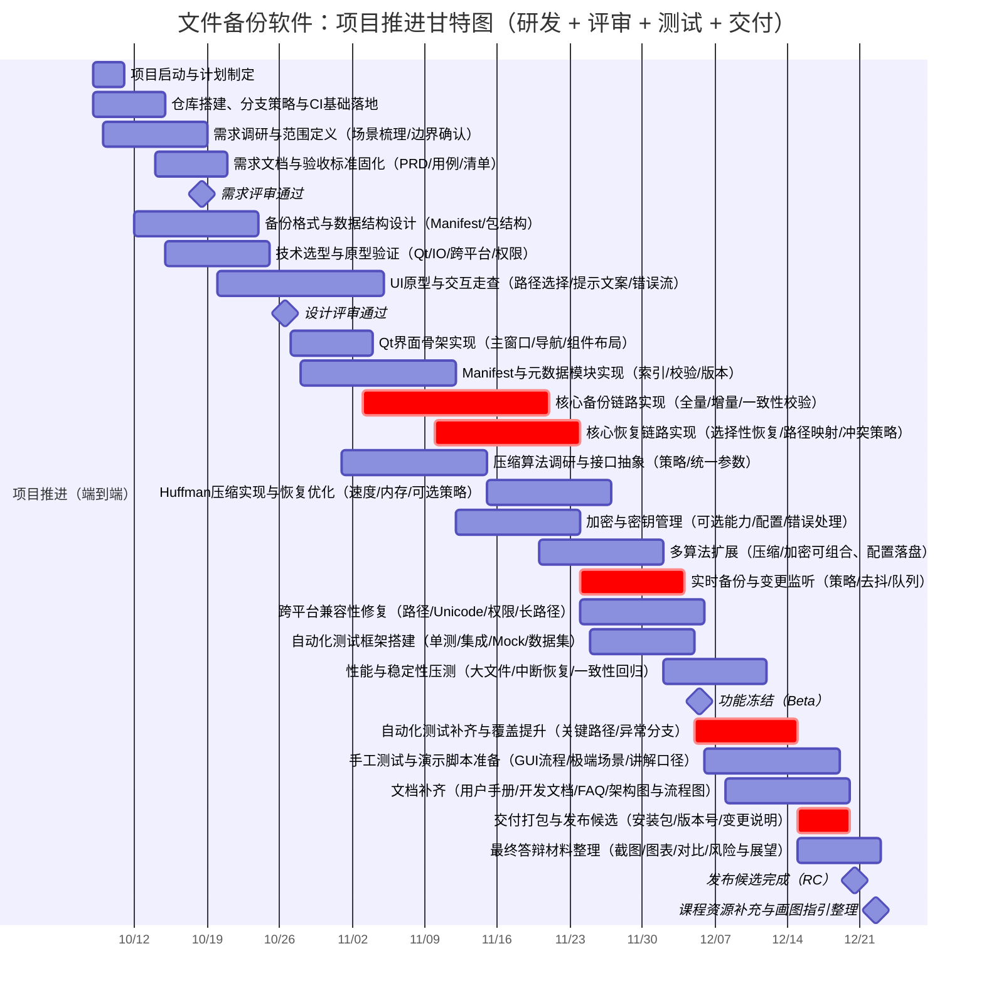

# 实验报告（综合）

> 说明：本文件依据《小组提交文档-实验报告模板》撰写，并以当前“文件备份软件”代码仓库的实际实现为准。对模板中需要由小组自行补充、或需要在 Word 版中插入图表的位置，本文会直接写明【待补充】与具体操作建议，便于后续统一完善排版。

## 一、实验室名称

本次实验的实验室名称为【待补充：例如“清水河校区××楼××实验室”或课程统一规定的实验室名称】。如果老师要求填写固定格式，请在提交前按要求替换此处，并与最终 Word/PDF 版本保持一致。

## 二、实验项目名称

本实验项目名称为文件备份软件。

## 三、实验目的

本次综合实验以一个可运行的软件项目为载体，把程序设计、数据结构与算法、软件工程三类知识落到同一套代码库里：用 C++17 和 Qt 完成跨平台桌面 GUI，围绕文件系统完成备份、恢复、验证等核心流程，在压缩与加密部分实践哈夫曼树、RLE 等算法思路，并通过需求、设计、测试与 Git 协作把工程流程跑完整。最终目标不是追求商业级产品，而是在学期周期内形成一套“能用、可测、可维护、可交付”的小型工程成果。

## 四、实验内容

我们实现的是一款本地单机文件备份工具，支持用户选择源目录或单个文件，将其内容备份到目标位置，并在需要时从备份中恢复到指定目录，同时提供完整性验证能力，避免备份数据被篡改或损坏后无法感知。备份既支持目录形式保存，也支持打包为单文件的自定义 `.fbk` 备份包；无论哪种模式，备份都会生成 manifest（清单）记录文件路径、大小、哈希、存储偏移等信息，供恢复与验证使用。为了满足扩展需求，系统提供无损压缩与口令加密两类可选能力，其中压缩包括 Huffman、RLE、Zlib，加密包括 XOR、RC4 与“简化 AES-256”（仅用于教学演示，不等同于标准 AES）。在功能层面，我们还实现了定时备份与实时备份：定时备份支持按每天、每周、每月执行，并可配置保留数量自动清理旧备份；实时备份通过监控目录变化自动触发备份，并使用防抖延迟减少频繁重复运行。界面方面，软件基于 Qt Widgets，提供备份、恢复、实时备份、定时备份四个标签页，并在操作过程中显示日志与进度，便于用户理解执行状态。

工程过程上，我们遵循实验模板要求，形成了需求分析说明书、系统设计文档和软件测试报告，并将关键使用说明写入 `README.md` 与 `用户使用指南.md`。同时，仓库中加入了基于 GoogleTest 的自动化单元测试与集成测试，用于回归验证核心流程、边界条件和 Unicode 场景，保证后续同学接手开发时能够快速定位回归风险。

## 五、实验器材（设备、元器件）

本项目在普通个人电脑上即可完成开发与运行，开发验证主要在 macOS 环境完成，其它平台（Windows、Linux）原则上可编译运行，但仍需要在对应环境补充回归验证。软件环境方面，项目采用 CMake 构建，使用 Qt 6（Core、Gui、Widgets、Concurrent）以及支持 C++17 的编译器（clang、MSVC 或 g++）。版本管理使用 Git，并按团队协作习惯在 GitHub 上采用分支与 Pull Request 进行合并。测试框架使用 GoogleTest，通过 CMake FetchContent 引入；在网络受限环境下运行测试需要提前缓存依赖或在可联网时完成首次配置。

## 六、实验步骤及操作（概览）

整个项目按“先打通主流程，再逐步扩展，再补齐测试与文档”的思路推进。我们首先阅读实验指导书与评分点，讨论基础功能与扩展功能边界，形成第一版需求分析并在组内评审；需求稳定后进入系统设计阶段，明确分层架构与模块职责，重点把备份格式（manifest 与 `.fbk` 包）以及压缩、加密策略的扩展点设计清楚。编码实现时，我们先实现备份、恢复与验证三条主链路，让软件达到可用状态，再逐步加入压缩、加密、打包、保留策略以及定时与实时备份等扩展点。测试阶段一方面进行 GUI 手工走查，另一方面用 GoogleTest 编写单元测试与集成测试，覆盖正常流程、异常输入、边界数据以及 Unicode 文件名与内容。最后，我们按模板整理文档并与代码保持同步，将已实现功能、使用方式与后续改进方向统一写入仓库，便于验收与二次开发。

## 七、实验结论

本项目已经实现了一套可以实际运行的文件备份软件，覆盖备份、恢复、验证等基础功能，并完成压缩、加密、打包、定时备份、实时备份等主要扩展点。系统的核心逻辑集中在 `BackupEngine` 与 `BackupTypes` 中，界面层负责收集用户输入与呈现结果，二者通过选项与结果结构体解耦；仓库中同时提供了自动化测试用例，可重复运行用于回归验证。仍待进一步完善的部分主要集中在跨平台差异细节、极端异常场景（磁盘满、断电、权限频繁变化等）的恢复能力、性能基准数据以及更严格的密码学实现，后续可按测试报告中的建议继续迭代。

## 八、总结及心得体会（按小组实际情况补充）

实现过程中最耗时的并不是界面搭建，而是对文件系统复杂性的处理。目录遍历需要兼顾符号链接、权限、隐藏文件与路径规范化；备份与恢复还牵涉相对路径与根目录命名规则，以及不同操作系统对权限与时间戳的差异。我们最终在 `BackupTypes` 中对文件类型与 manifest 字段做统一抽象，用 JSON 形式保存 manifest，并在解析时加入版本兼容逻辑，这让后续加入压缩、加密与打包模式时的改动更可控。另一个实践收获是 UI 与后台任务的解耦：备份过程可能较长，如果直接在 UI 线程执行会导致界面卡死，因此我们使用 `QtConcurrent` 在后台运行耗时任务，并通过回调把日志与进度推回界面，从而保证交互流畅。

团队协作方面的体会需要结合小组实际补充，例如每位成员在功能开发、测试编写、文档整理上的分工，以及使用 Git 分支、Pull Request 与代码评审时遇到的冲突和解决办法。【待补充：写清楚各成员承担的模块、沟通方式、冲突解决与经验总结。】

## 九、对本实验过程及方法、手段的改进建议（按实际体验补充）

从课程角度看，如果能在项目早期提供一次更偏实战的 Git/GitHub 协作示范，例如如何拆分任务、如何写 Pull Request、如何做最小化评审，会显著降低同学在流程上的试错成本；同时如果能给出一个最小可运行的测试框架模板，也能让更多小组更早把自动化测试纳入开发节奏。从我们自身角度，下一次再做类似项目时应该更早把测试与文档纳入迭代节奏，而不是等功能稳定后集中补齐；另外涉及加密这类安全敏感内容，即使是教学实现，也应在需求阶段就明确“仅演示”的边界，并在界面和文档中把风险提示写得更醒目。

---

# 需求分析说明书

> 本节对应模板中的“需求分析说明书”部分，结构与编号按模板组织。本文以可读性优先，正文采用自然段描述；如需在 Word 版中使用表格或插入图形，请按文中的【待补充】提示操作。

## 1. 任务概述

### 1.1 引言

本需求分析说明书用于描述“文件备份软件”的业务目标、功能边界与非功能约束，并作为后续系统设计、编码实现与测试验收的共同依据。本文档面向的读者主要是项目组成员、实验指导教师以及后续可能接手维护与扩展的同学，因此在表述上尽量同时兼顾“可检查”和“易理解”两点。文档中的需求描述以当前仓库实现为基准，若后续版本新增功能或调整格式，应同步更新本文档并在版本规划中说明变更原因。

### 1.2 综合描述

#### 1.2.1 产品的状况

本项目是面向软件工程课程综合实验的教学项目，强调工程流程完整与关键技术点覆盖，而非面向商业发布。系统定位为单机本地备份工具，主要与操作系统文件系统交互，负责读取源文件、写入备份数据、保存元数据并在恢复时还原；同时依托 Git/GitHub 完成团队协作、版本追踪与文档沉淀。未来如果要扩展为网络备份或云备份，可以在现有 manifest 与算法策略的基础上演进，但当前版本并不依赖后端服务。

#### 1.2.2 产品的功能（业务层面概览）

从用户视角看，软件提供三类核心能力。第一类是备份与恢复：用户选择源路径与目标位置后即可生成备份，支持目录形式保存，也支持将结果打包为单文件 `.fbk` 以便传输和管理；恢复时用户选择备份路径与恢复目标，系统根据 manifest 将数据写回文件系统。第二类是数据正确性与安全性：系统为每个文件记录哈希，用于验证备份完整性；当用户开启加密时，备份内容在存储前会被加密，恢复与验证需要提供相同密码。第三类是自动化能力：定时备份可以按设定周期在后台触发备份并执行保留策略；实时备份会监控目录变化，在检测到新增、修改或删除后自动生成新的备份版本。上述功能通过 Qt GUI 呈现为备份、恢复、实时备份、定时备份四个页面，并提供日志与进度反馈。

#### 1.2.3 用户特征

本软件面向的典型用户包括需要备份个人文件的学生与教师，以及希望通过项目学习软件工程流程的同学。我们假设用户具备基本的文件系统操作能力，例如知道文件夹与文件的概念、能理解“源路径”和“目标路径”的含义，但不要求用户具备命令行经验或编程背景。因此界面与提示信息尽量使用直白表达，并把复杂的算法选择放在可选项中，避免影响“一键备份/一键恢复”的主流程。

#### 1.2.4 约束

在开发约束上，本项目必须使用 C++ 与 Qt，并通过 CMake 进行跨平台构建，同时需要使用 Git/GitHub 进行版本管理并保留可追溯的提交记录。在运行约束上，系统应在单机环境下即可运行，不依赖外部服务；在受限权限环境下也应尽量给出明确报错并保证不崩溃。考虑到课程时间限制，一些更复杂的能力（例如真正的增量备份、网络同步、权限跨平台一致还原）在当前版本只作为后续扩展方向讨论。

#### 1.2.5 假设与依赖

我们假设用户具备足够磁盘空间存储备份数据，并在备份过程中尽量避免对目标目录进行人为篡改；如果发生断电或强制退出导致中间文件残留，用户可能需要按提示手动清理。系统依赖操作系统提供稳定的文件系统 API，以及 Qt 与编译器环境正确安装；自动化测试依赖 GoogleTest，首次配置测试时可能需要联网拉取依赖或使用本地缓存。对于 Unicode 文件名与内容，本项目统一按字节流处理数据，文件路径由 Qt 的 `QString` 管理并在读写时以 UTF-8/本地编码进行转换，相关场景已在测试中覆盖。

## 2. 业务需求

### 2.1 业务背景

现实场景中，课程资料、代码仓库、论文与实验数据经常需要备份。仅靠手动复制容易遗漏，且一旦覆盖或误删往往难以追溯。因此我们的业务目标是提供一个简单、可验证的备份工具，让用户能够以较低成本完成“备份—恢复—验证”的闭环，同时支持压缩以节省空间、加密以提供基础隐私保护，并在定时与实时场景下减少人工操作。

### 2.2 业务流程（如何画业务流程图）

建议在 Word 版报告中绘制一张业务流程图，用于直观呈现用户操作与系统处理之间的关系。流程图可以使用 draw.io、ProcessOn、Visio 等工具完成，建议至少包含四条典型流程：手动备份从用户启动程序开始，依次选择源路径与目标路径，配置压缩、加密、打包与验证选项后执行备份，最后查看结果与日志；恢复流程从选择备份目录或 `.fbk` 文件开始，选择恢复目标并在需要时输入密码，然后执行恢复并查看结果；定时备份流程从设置页配置源、目标、频率、执行时间与保留策略开始，启用后程序在后台按计划触发备份并自动清理旧版本；实时备份流程围绕监控目录，启用后系统监听文件变化并在短暂延迟后自动生成新备份。绘图时可以用圆角矩形表示开始与结束，用矩形表示业务活动（例如生成 manifest、写入备份包），用菱形表示决策点（例如是否启用压缩、是否启用加密），并用箭头连接方向。【待补充：将绘制好的流程图导出为 PNG 或 SVG，插入最终 Word 版报告相应位置。】

## 3. 功能需求

本节给出软件必须交付的功能需求，并为每一项需求提供唯一标识，便于需求追踪、测试设计与验收。需求编号采用 `FR-UCxx-yy` 形式，其中 `UCxx` 对应用例编号，`yy` 是该用例下的顺序号；同一编号在后续设计、测试与缺陷追踪中保持不变。为了避免“只画图不落地”，下文对每个用例不仅给出用例图与用例描述，还会把可验收的功能点逐条写成带编号的需求条目，并明确常见非法输入或出错条件下软件应当如何响应。

### 3.1 功能划分

从用户业务角度看，本系统的功能可以划分为备份管理、恢复管理、验证管理、定时备份、实时备份与日志反馈六个功能域。备份管理负责把源路径的文件与目录以目录模式或 `.fbk` 包模式输出到目标位置，并在需要时执行压缩、加密与备份后校验；恢复管理负责从备份目录或 `.fbk` 包中将数据恢复到指定位置，并在需要时解密与解压；验证管理负责对备份执行完整性检查，输出失败文件数量与错误原因；定时备份负责计划配置与按时间触发执行，并在多次备份后维护保留数量；实时备份负责对监控目录的变化进行监听与防抖，自动触发备份；日志反馈负责把过程信息、错误原因与统计结果以用户可理解的方式展示在界面中，便于用户判断是否需要重试、验证或更换配置。

### 3.2 系统用例

系统的主要参与者为普通用户。用例 UC01 到 UC06 属于核心交付能力，覆盖手动备份、恢复、验证以及两类自动化备份；UC07 负责把“过程日志与结果信息”提供给用户查看。用例图均已绘制并存放于仓库 `资源/png/` 目录，本文直接用 Markdown 引用图片，便于在 GitHub 或本地预览。

#### 3.2.1 用例编号 UC01（创建备份）

##### 3.2.1.1 用例图

##### 3.2.1.2 用例描述

简要描述：用户在“备份”页面选择源路径与目标路径，并根据需要配置压缩、加密、打包与校验等选项，系统生成一份可恢复且可验证的备份结果，并在界面中输出日志与进度。

前置条件：系统处于可用状态且未在执行其它备份任务；源路径存在且可读；目标路径存在且可写，或系统能够在该路径下创建备份输出目录；当用户启用加密时，密码应为非空字符串。

基本事件流：用户在界面中选择源路径与备份保存位置，并确认备份名称或使用默认命名规则；随后用户点击开始备份，系统开始遍历源路径，生成包含文件列表与元数据的 manifest，并对每个文件计算哈希；系统按用户配置决定是否执行压缩与加密，然后将数据写入备份目录或 `.fbk` 备份包；备份完成后系统在界面中提示成功，并显示备份输出位置与统计信息，如果用户勾选了“备份后校验”，系统会在备份完成后继续执行一次验证并给出校验结果。

其他事件流：当用户选择启用压缩时，系统应按所选算法对数据执行无损压缩；当用户选择启用加密时，系统应在写入前对数据加密，并在 manifest 中记录加密方法与必要信息；当用户选择打包为 `.fbk` 时，系统应按包格式将数据块与 manifest 封装为单文件，便于移动和管理；当用户关闭“包含特殊文件”或“保留元数据”时，系统应按开关行为调整文件类型处理与元数据写入策略。

异常事件流：当源路径为空、源路径不存在或不可读时，系统应拒绝开始备份并提示原因；当目标路径为空、不可写或无法创建输出目录时，系统应拒绝开始备份并提示原因；当用户启用加密但密码为空时，系统应直接提示“请填写密码”并阻止执行；当备份过程中出现文件读写失败、权限不足、路径过长或磁盘空间不足等错误时，系统应在日志中记录具体原因，并保证程序不崩溃，且最终以失败状态结束本次备份或明确标注哪些文件未能成功处理。

后置条件：备份成功时，系统在目标路径下生成完整备份产物（目录结构或 `.fbk` 文件）以及可用于恢复与验证的 manifest，并在界面中显示备份位置与统计信息；备份失败时，系统应在界面中给出明确错误提示，必要时清理不完整的中间产物或将其标记为不可用，以避免用户误用。

##### 3.2.1.3 功能需求条目（唯一标识）

FR-UC01-01：系统应允许用户选择存在的源路径，源路径既可以是目录也可以是单个文件，并在界面中清晰展示该路径。

FR-UC01-02：系统应允许用户选择备份保存位置，并在目标位置不可写、为空或无法创建输出目录时拒绝执行并提示具体原因。

FR-UC01-03：系统应在备份开始前对输入做基本校验，至少覆盖空路径、路径不存在与加密密码为空三类非法输入，并以弹窗或日志明确告知用户如何修正。

FR-UC01-04：系统应在备份过程中生成 manifest，用于记录文件列表、相对路径、大小、哈希、是否压缩/加密、所选算法、存储模式以及必要的元数据信息，使得恢复与验证不依赖额外人工信息。

FR-UC01-05：系统应支持目录备份与 `.fbk` 打包备份两种存储模式，并在备份成功后向用户返回备份位置或备份包文件路径。

FR-UC01-06：当用户启用压缩时，系统应按所选算法执行无损压缩，并在恢复时能够无损还原；当用户未启用压缩时，系统不应对数据做压缩处理。

FR-UC01-07：当用户启用加密时，系统应要求用户提供非空密码，并按所选算法对数据加密；系统应在恢复与验证时要求提供密码才能正确处理加密数据。

FR-UC01-08：系统应提供“备份后校验”选项，启用后在备份完成后自动执行验证并输出校验结果，关闭后不应自动执行验证。

FR-UC01-09：系统应在备份过程中持续输出进度与日志信息，至少能让用户判断当前是否仍在运行、处理到哪个阶段以及是否发生错误。

FR-UC01-10：当备份过程中发生已知错误（如权限不足、文件无法读取、磁盘写入失败）时，系统应给出明确错误信息并保证程序不崩溃，且最终以可识别的失败状态结束本次任务。

#### 3.2.2 用例编号 UC02（恢复备份）

##### 3.2.2.1 用例图

##### 3.2.2.2 用例描述

简要描述：用户选择一个备份目录或 `.fbk` 备份包，并选择恢复目标位置；系统解析 manifest，按需要执行解密与解压，将文件内容与目录结构恢复到目标位置，并在界面中输出日志与结果统计。

前置条件：系统处于可用状态且未在执行其它恢复或验证任务；用户提供的备份路径存在且是有效备份（包含可解析的 manifest 或 `.fbk` 包头与 manifest）；恢复目标路径存在且可写，或系统能够创建所需目录；若备份启用了加密，用户应提供正确的密码。

基本事件流：用户在恢复页面选择备份路径与恢复目标目录，并在需要时填写密码；用户点击开始恢复后，系统读取并解析 manifest，按其中记录的文件列表逐个恢复，若数据被压缩则先解压，若数据被加密则先解密，随后将内容写入恢复目录，并在可能的情况下恢复权限与时间戳等元数据；恢复完成后系统提示成功，并显示恢复输出位置与恢复文件数量。

其他事件流：当备份是 `.fbk` 包模式时，系统应从单文件中按偏移读取对应数据块并恢复；当备份是目录模式时，系统应从备份目录的 data 区域读取数据并恢复；当备份包含符号链接或其它特殊文件时，系统应按“包含特殊文件”的记录策略进行还原或跳过，并在日志中说明处理结果。

异常事件流：当备份路径为空、备份路径不存在或不是有效备份时，系统应拒绝恢复并提示“备份无效或缺少 manifest”；当恢复目标不可写或无法创建目录时，系统应拒绝恢复并提示原因；当备份启用了加密但用户未输入密码时，系统应提示需要密码并阻止执行；当用户输入错误密码时，系统可能无法在解密阶段直接发现错误，但系统应建议用户在恢复后立即执行“验证备份”或自动触发一次验证，并在验证失败时提示用户密码可能错误或备份可能损坏；当恢复过程中遇到文件写入失败、权限不足或磁盘空间不足等错误时，系统应记录具体失败原因并以失败状态结束或标注部分恢复失败。

后置条件：恢复成功时，系统在恢复目标目录下生成与源路径一致的目录结构与文件内容，并尽可能恢复相关元数据；恢复失败时，系统应给出明确错误提示并保持界面可继续操作，且不应让用户误以为数据已经完整恢复。

##### 3.2.2.3 功能需求条目（唯一标识）

FR-UC02-01：系统应允许用户选择备份路径，备份路径既可以是目录备份也可以是 `.fbk` 备份包，并在界面中清晰展示。

FR-UC02-02：系统应允许用户选择恢复目标目录，并在目标目录为空、不可写或无法创建输出目录时拒绝恢复并提示原因。

FR-UC02-03：系统应在恢复开始前校验备份有效性，至少检查 manifest 是否存在且可解析，或 `.fbk` 包是否具备可识别的格式信息，并在无效时拒绝执行。

FR-UC02-04：系统应在恢复时解析 manifest，并以 manifest 中记录的文件列表为准执行恢复，保证恢复结果可预测且可与验证逻辑对齐。

FR-UC02-05：当备份启用了压缩时，系统应在恢复过程中对数据执行对应的解压操作，并保证解压后的内容与原始内容一致。

FR-UC02-06：当备份启用了加密时，系统应要求输入密码并执行对应的解密操作；当密码为空时属于非法输入，系统应阻止恢复并提示补充密码。

FR-UC02-07：当用户提供错误密码导致恢复内容不正确时，系统应提供可执行的验证途径，并在验证失败时提示“密码错误或备份损坏”的可能性，避免用户误以为恢复结果可信。

FR-UC02-08：恢复完成后系统应向用户展示恢复输出位置与统计信息，至少包括恢复文件数量与是否成功。

FR-UC02-09：恢复过程中系统应持续输出日志信息，遇到已知错误条件（如无法写入、权限不足、磁盘满）时应输出可理解的错误原因并保持程序稳定。

#### 3.2.3 用例编号 UC03（验证备份）

##### 3.2.3.1 用例图

##### 3.2.3.2 用例描述

简要描述：用户选择一个备份目录或 `.fbk` 备份包，系统读取并解析 manifest，对备份数据执行哈希校验，并给出通过或失败的结果统计，用于发现备份损坏或被篡改的情况。

前置条件：系统处于可用状态且未在执行其它验证或恢复任务；备份路径存在且有效；若备份启用了加密，用户应提供密码以便系统解密后计算正确的校验数据。

基本事件流：用户选择备份路径并点击验证，系统读取并解析 manifest；系统按文件列表逐个读取备份中的存储数据，必要时执行解密与解压，然后计算哈希或对比 manifest 中的哈希记录，并汇总校验结果；验证完成后系统显示校验通过或失败，并输出检查文件数量、失败文件数量以及典型错误原因。

其他事件流：当备份采用 `.fbk` 包模式时，系统应按偏移读取数据块并执行校验；当备份采用目录模式时，系统应从备份目录读取数据并校验；当备份规模较大时，系统应提供进度信息，避免用户误以为程序卡死。

异常事件流：当备份路径为空、不存在或不是有效备份时，系统应拒绝验证并提示“备份无效”；当备份数据缺失、损坏或 manifest 内容不一致时，系统应将对应文件判定为失败并在结果中体现；当用户未提供加密密码或密码错误时，系统应提示需要密码或提示“密码错误/备份损坏”的可能性，并以失败或部分失败结束验证；验证过程不应修改任何备份数据或用户文件。

后置条件：验证结束后系统给出明确结果，用户能够据此决定是否需要重新备份、重新恢复或更换密码；系统不应因验证失败导致不可恢复的副作用。

##### 3.2.3.3 功能需求条目（唯一标识）

FR-UC03-01：系统应支持对目录备份与 `.fbk` 备份包两种形式执行验证，并对用户隐藏底层存储差异。

FR-UC03-02：系统应在验证开始前检查备份路径的有效性，并在缺少 manifest 或格式无法识别时拒绝执行并提示原因。

FR-UC03-03：系统应读取并解析 manifest，并以其中记录的文件列表、哈希与存储信息为依据执行验证，确保验证过程可复现。

FR-UC03-04：系统应对备份数据执行哈希校验或等价的完整性校验，并输出检查文件数量与失败文件数量，使用户能够量化判断问题范围。

FR-UC03-05：当备份启用了压缩或加密时，系统应在验证过程中按需要解压与解密，以保证校验基于真实内容而非压缩密文。

FR-UC03-06：当用户未提供加密密码或密码错误时，系统应提示需要正确密码，并在校验失败时提示“密码错误或备份损坏”的可能性。

FR-UC03-07：验证过程应为只读操作，不应修改备份数据、manifest 或用户源文件与恢复目标文件。

FR-UC03-08：验证过程中系统应输出进度与日志信息，在遇到数据缺失、读取失败等已知错误条件时应给出明确原因并保持程序稳定。

#### 3.2.4 用例编号 UC04（配置定时备份计划）

##### 3.2.4.1 用例图

##### 3.2.4.2 用例描述

简要描述：用户在“定时备份”页面配置定时任务的源路径、保存位置、执行频率与时间，并配置压缩、加密、打包、校验以及保留数量等策略；系统保存该计划并在启用后进入等待触发状态。

前置条件：系统处于可用状态；用户能够选择合法的源路径与目标路径；当用户启用加密时密码为非空；定时任务尚未被禁用或冲突配置未被拒绝。

基本事件流：用户进入定时备份页面，选择源目录与备份保存位置，设置频率为每天、每周或每月，并选择执行时间；用户根据需要配置压缩、加密、打包、是否校验、是否保留元数据、是否包含特殊文件以及保留数量；用户勾选启用定时备份后，系统对配置做校验并保存为当前计划，同时显示下一次触发时间或等待提示。

其他事件流：当用户修改频率或时间时，系统应更新下一次触发时间的计算依据；当用户修改保留数量时，系统应在下一次执行后按新策略清理旧备份；当用户临时取消启用时，系统应停止触发但保留计划配置，便于再次启用。

异常事件流：当源路径或目标路径为空、不可用或不可写时，系统应拒绝启用定时备份并提示原因；当用户启用加密但密码为空时，系统应拒绝启用并提示补充密码；当计划尚未配置完成时用户勾选启用，系统应提示先完成配置而不是进入不确定状态。

后置条件：配置成功后，系统保留一份可执行的定时计划，并在启用状态下等待触发；配置失败时系统给出明确提示且不进入启用状态。

##### 3.2.4.3 功能需求条目（唯一标识）

FR-UC04-01：系统应允许用户配置定时备份的源目录与备份保存位置，并在配置为空或不可用时拒绝启用定时任务。

FR-UC04-02：系统应支持按每天、每周、每月三种频率配置定时备份，并允许用户选择具体执行时间。

FR-UC04-03：系统应允许用户为定时任务配置压缩、加密、打包与备份后校验等选项，并保证这些选项在实际执行时与手动备份行为一致。

FR-UC04-04：当用户为定时任务启用加密时，系统应要求输入非空密码；密码为空属于非法输入，系统应拒绝启用任务并提示补充密码。

FR-UC04-05：系统应允许用户配置保留数量，并在后续执行中按保留数量自动删除旧备份，避免备份无限增长占满磁盘。

FR-UC04-06：系统应在用户启用或停用定时备份时给出明确状态提示，并在启用状态下能够计算并展示下一次触发时间或等价信息。

#### 3.2.5 用例编号 UC05（执行定时备份）

##### 3.2.5.1 用例图

##### 3.2.5.2 用例描述

简要描述：当到达定时计划设定的触发时间时，系统自动按计划执行一次备份，并按保留策略清理旧备份，同时在界面中输出执行日志与结果。

前置条件：定时备份计划已配置完成且处于启用状态；系统处于运行中且能够访问源路径与目标路径；若计划启用了加密则密码已保存于运行配置中。

基本事件流：系统检测到当前时间达到计划触发点后，自动构造与计划一致的备份选项并调用备份流程执行，备份过程与 UC01 一致；备份完成后系统按保留数量策略清理旧备份，使目标目录中备份数量不超过配置值；系统在界面中记录本次执行结果与日志，并在必要时提示用户查看详情。

异常事件流：当触发时源路径不可访问、目标路径不可写或磁盘空间不足时，系统应记录失败原因并保持定时任务后续仍可继续触发，避免一次失败导致功能永久失效；当备份执行时间过长导致与下一次触发冲突时，系统应避免并行启动多个备份任务，并在日志中说明“上一任务未完成，本次跳过或延后”的处理策略。

后置条件：执行成功时产生一份新的备份版本并完成保留策略清理；执行失败时记录失败原因且不影响用户继续手动操作或后续触发。

##### 3.2.5.3 功能需求条目（唯一标识）

FR-UC05-01：系统应在定时计划到点时自动触发一次备份，其备份行为与 UC01 保持一致，包括压缩、加密、打包与校验等选项。

FR-UC05-02：系统应在一次定时备份结束后执行保留策略，使备份数量不超过配置的保留数量，并在日志中说明删除了哪些旧备份或为何未删除。

FR-UC05-03：系统应避免在同一时刻并行执行多个定时备份任务，当上一任务尚未结束时应采取跳过或延后策略，并在日志中说明。

FR-UC05-04：当定时备份因源路径不可访问、目标不可写或磁盘写入失败而无法完成时，系统应记录失败原因并保持定时机制继续运行，避免一次失败导致后续不再触发。

FR-UC05-05：系统应在界面中提供定时备份的执行日志与结果反馈，使用户能够查看最近一次执行是否成功以及失败原因。

#### 3.2.6 用例编号 UC06（开启实时备份监控）

##### 3.2.6.1 用例图

##### 3.2.6.2 用例描述

简要描述：用户在“实时备份”页面选择需要监控的目录与备份保存位置并启用实时备份；系统注册文件系统监听，捕获变更事件并在防抖延迟后自动触发备份，同时按保留策略维护最近版本数量。

前置条件：系统处于可用状态且具备监听目录变化的权限；监控目录存在且可访问；备份保存位置存在且可写；当启用加密时密码非空；实时备份尚未处于启用状态或用户已明确重新配置。

基本事件流：用户选择监控目录与保存位置，设置防抖延迟与保留数量，并根据需要设置压缩、加密、打包与校验选项；用户勾选启用实时备份后，系统注册目录监听并进入监控状态；当目录发生变更时系统记录事件并启动或重置防抖计时器，计时结束后触发一次备份，备份行为与 UC01 一致；备份结束后系统更新状态并在界面中记录本次自动备份结果，同时按保留数量清理旧备份。

异常事件流：当监控目录为空或不存在时，系统应拒绝启用实时备份并提示原因；当保存位置不可写或为空时，系统应拒绝启用并提示原因；当启用加密但密码为空时，系统应拒绝启用并提示补充密码；当监控期间频繁出现文件变更时，系统应通过防抖机制减少触发频率，避免每次文件写入都立即触发备份导致性能问题；当自动备份失败时系统应记录失败原因并恢复到可继续监控的状态，避免一次失败后进入不可用状态。

后置条件：启用成功时系统处于监控状态，并能在目录变化后自动生成备份；停用后系统应取消监听并停止自动触发，且不影响用户手动备份与恢复。

##### 3.2.6.3 功能需求条目（唯一标识）

FR-UC06-01：系统应允许用户选择监控目录与备份保存位置，并在路径为空、不可访问或不可写时拒绝启用实时备份并提示原因。

FR-UC06-02：系统应在启用实时备份后注册文件系统监听，能够捕获新增、修改、删除等变更事件并据此触发备份。

FR-UC06-03：系统应提供防抖延迟配置，在连续变更发生时合并触发，避免频繁执行备份导致性能下降。

FR-UC06-04：系统在自动触发备份时应复用 UC01 的备份流程，并支持压缩、加密、打包与校验等配置选项。

FR-UC06-05：系统应支持实时备份的保留数量配置，并在产生新备份后按策略删除旧备份，保证备份数量不会无限增长。

FR-UC06-06：当实时备份执行失败时，系统应记录失败原因并回到可继续监控的状态，避免一次失败导致实时备份永久失效。

FR-UC06-07：系统应在界面中提供实时备份状态与日志输出，使用户能够判断当前是否在监控、是否在等待触发以及最近一次备份是否成功。

#### 3.2.7 用例编号 UC07（查看备份与恢复日志）

##### 3.2.7.1 用例图

##### 3.2.7.2 用例描述

简要描述：用户在界面中查看备份、恢复、验证、定时与实时任务的运行日志与结果信息，以便判断任务是否成功、失败原因是什么以及是否需要再次执行或进行验证。

前置条件：系统处于运行状态并且至少执行过一次相关任务，或用户已进入相应页面；日志输出模块可用。

基本事件流：用户进入备份或恢复页面后，系统在任务执行过程中持续输出日志；任务结束后用户仍可在同一页面查看该次任务的日志与结果摘要，并据此决定是否需要重新选择路径、修改选项或执行验证。对于定时与实时备份，系统同样在对应页面输出状态变化、触发原因与执行结果。

异常事件流：当任务尚未执行且日志为空时，系统应给出合理的空状态提示而不是显示无意义内容；当日志输出过多时系统应保持界面可用，不应因为日志追加导致卡死。

后置条件：用户能够从日志中获取足够信息判断任务结果，系统不应因为查看日志而改变任何备份或用户文件。

##### 3.2.7.3 功能需求条目（唯一标识）

FR-UC07-01：系统应在备份、恢复与验证等耗时任务执行过程中持续输出日志信息，至少包含阶段提示与错误原因，使用户能判断系统是否仍在运行。

FR-UC07-02：系统应在任务完成后保留该次任务的日志与结果摘要，用户能够在界面中回看本次运行信息，而无需重新执行任务。

FR-UC07-03：当日志为空时系统应提供清晰的空状态提示；当发生错误时系统应输出可理解的错误信息，并避免仅给出“出错”一类模糊描述。

FR-UC07-04：日志展示不应阻塞界面主线程，不应因为日志追加导致明显卡顿或界面无响应。

FR-UC07-05：用例图中“读取历史日志文件”和“导出日志报告”属于可扩展需求，当前版本以界面实时日志为主；若后续实现，应补充对应需求编号、界面入口与文件格式约定，并在测试报告中加入回归用例。【待补充：若小组后续补齐该功能，可在此处将其拆分为可验收的 FR 条目并给出实现说明。】

## 4. 其它非功能性需求

### 4.1 性能需求

本项目的性能需求主要来自三个使用场景：一是用户在界面上发起手动备份、恢复与验证，期望操作反馈及时且界面不冻结；二是定时备份在后台按计划触发，期望在系统负载波动时仍能稳定执行；三是实时备份对目录变化做监听并自动触发，期望在频繁改动的情况下不过度打扰系统，也不出现“连环备份”把磁盘与 CPU 占满。备份软件的性能瓶颈往往不是算法本身，而是磁盘读写与文件系统遍历，因此我们在设计上优先保证数据读写路径清晰、错误处理可控，并把压缩与加密做成可选项，让用户在“速度、空间、隐私”之间自行取舍。对于同一份数据，压缩的收益高度依赖数据特征，文本与重复数据往往压缩率高，随机二进制数据则可能几乎不可压缩；在这种情况下强行压缩只会浪费 CPU 并拖慢速度，所以系统应允许用户关闭压缩并给出合理默认值。

关于相互合作的用户数量，本项目定位为单机桌面工具，不提供多用户在线协作能力，典型情况下同一时刻只有一个用户在本机操作，也不要求多人同时对同一份备份进行写入。并发操作数量方面，我们把“会产生大量 I/O 的核心任务”定义为备份、恢复与验证三类，引擎侧不应该在同一时刻并行执行多项核心任务，目标并发数为 1。这样做的依据很直接：备份与恢复天然是磁盘密集型工作，如果并行跑两条重任务，吞吐反而更差，还容易引入“日志交错、输出目录争用、保留策略互相删除”等难排查问题。当前实现采用后台线程执行耗时任务，并在界面层对任务状态做互斥控制；当用户在已有任务运行时再次点击开始按钮，界面会提示“任务进行中”并拒绝重复启动。定时与实时触发也应遵循同样的互斥策略，遇到冲突时宁可跳过一次触发，也要保证备份结果一致且可解释，并在日志中写清楚“本次未执行”的原因。

响应时间方面，界面层的基本交互应保持“即时可感知”。在体验上，按钮点击后不应出现长时间无反应的空窗期，因此建议把“点击开始”到日志出现“开始备份/开始恢复/开始验证”的时间控制在 1 秒以内，路径选择对话框的弹出应在 2 秒以内完成，勾选压缩或加密、切换算法、输入密码等纯界面操作应保持流畅，不应出现明显掉帧或冻结。对备份软件而言，最关键的不是单次任务的极限速度，而是任务运行期间界面始终可操作、可取消、可观察，因此耗时任务必须放在后台执行，界面持续刷新进度与日志，用户能明确知道“现在在做什么、还有多久、是否出错”。

对于实际数据处理耗时，我们更关心“规模与耗时的关系”是否符合直觉：在不启用压缩与加密时，备份与恢复主要受磁盘吞吐影响，耗时应大致随数据量线性增长；启用压缩或加密后，CPU 开销会显著上升，且不同算法的开销不同，数据越“可压缩”越可能用 CPU 换空间。为了便于验收与复现，建议用固定测试集衡量性能，并且把“备份输出大小、耗时、CPU 占用”一起记录下来，例如用同一批数据分别跑不压缩不加密、仅压缩、仅加密、压缩加密四组组合，再对比 Huffman、RLE、Zlib 的差异。这样得到的结果不但能写进报告，也能反过来指导默认选项的选择，避免把某一种算法无条件设成“最优”。

与实时系统的时间关系主要体现在定时与实时备份的触发精度。定时备份不追求毫秒级触发，但要“准得可解释”，也就是用户设置了某个时间点，系统应在这个时间点附近稳定启动，并且误差来源清楚可控。当前定时检查以分钟为粒度轮询，允许存在有限的触发抖动，因此需求上可以接受在设定时间点后 60 秒内启动。实时备份则更强调“防抖与可控”，系统捕获到文件变化后不应立刻每次都触发备份，而应在用户可配置的延迟时间后执行一次备份，并在延迟窗口内合并多次变化；当前默认延迟为 5 秒，并允许用户在 1 到 300 秒之间调整，这能覆盖“写文件很频繁的开发目录”和“改动不多但希望尽快备份的资料目录”两类需求。对于触发频率高的目录，实时备份默认关闭“备份后校验”也是出于同样考虑：校验能提高信心，但在高频场景下会显著增加负载，合理策略是由用户显式开启或在空闲时再做集中校验。

容量需求方面，需要分别考虑内存占用、磁盘空间与备份元数据规模。备份时系统需要维护文件列表与 manifest 数据结构，文件数量越多，manifest 越大，序列化与写入也会更耗时；对于包含成千上万小文件的目录，manifest 的规模会成为不可忽视的开销，因此系统应能在文件数量较大时仍保持稳定，并在日志中给出总文件数与总字节数，便于用户判断是否超出预期。一个更贴近验收的目标是支持“数万级文件数量”的目录备份与恢复，在这种规模下不出现明显卡死或崩溃，同时验证功能能够在可接受时间内完成全量比对。

内存占用与单文件大小直接相关。当前实现对单个文件的数据处理以字节数组为单位，适合课程规模的数据集，但对于极大单文件可能带来较高内存峰值，因此建议在使用上把单文件规模控制在几百 MB 以内，或者在备份巨大文件时关闭压缩与加密以降低内存压力。从需求角度看，更长期、也更“工程化”的目标是引入流式读写与分块压缩、分块加密机制，使内存占用不随单文件大小线性增长，这样才能把“容量”从用户习惯约束转为系统能力。

磁盘空间方面，备份的本质是“多保留一份数据”，因此最基本的要求是目标盘剩余空间至少要大于源数据规模。更现实的估算还要考虑保留策略与最坏情况膨胀：如果用户设置保留最近 N 份备份，那么空间预算应按 N 倍源数据规模来预留，并额外留出 manifest 与格式开销的余量；在压缩不生效甚至略微膨胀的情况下，这个余量就是风险缓冲。系统在开始备份前应提醒用户检查空间，并在写入失败或磁盘满时给出清晰错误提示，而不是只留下一个不完整的目录让用户猜测发生了什么。数据库容量不属于本项目范围，因为当前版本不使用数据库持久化配置或索引；如果未来扩展为“历史备份索引库”或“增量版本管理”，再单独补充表规模与索引需求即可。

### 4.2 安全性需求

本项目的安全性需求可以从保密性、完整性与可控性三个角度来理解。首先是保密性：备份文件可能会被复制到 U 盘、移动硬盘或云盘中传播，用户希望他人拿到备份文件后不能直接读取其中内容，因此系统提供口令加密作为基本保护措施。需要明确的是，本项目中的加密实现以教学演示与工程实践为主要目的，其中“简化 AES-256”并不等同于标准 AES 实现，不能作为强安全承诺；因此在需求层面应当把加密定位为“提高随意窥探成本”的保护手段，并在用户指南中明确说明适用边界。如果后续要满足更严格的保密性要求，应替换为经过验证的密码学库，并补齐随机数、密钥派生、认证加密与版本兼容策略等必要设计。

从产品使用角度看，本项目没有账号登录、没有权限角色划分，所谓“身份认证”主要体现在“是否掌握备份口令”。因此口令的输入体验与处理策略本身就是安全需求的一部分。口令应允许用户输入常见字符与 Unicode 字符，避免因为编码问题导致跨平台恢复失败；口令长度不宜过短，建议在用户指南中明确提示至少 8 个字符，并鼓励使用混合字符集。口令在界面上必须以密码框形式输入，不能在日志里回显；对于定时与实时备份，口令只在运行期驻留内存并随程序退出清空，默认不落盘持久化，以降低本机泄露风险。若未来需要“重启后仍能自动定时备份”，则必须引入更安全的凭据存储方式，例如调用操作系统的 Keychain/凭据管理器，而不是把口令写进明文配置文件。

其次是完整性：备份系统最忌讳的不是“备份失败”，而是“看似成功但数据悄悄损坏”。因此系统必须提供可验证的完整性机制，并在验证失败时给出清晰反馈。当前设计以文件哈希为核心，把校验信息写入 manifest，验证时重新计算并对比；这类机制不仅能发现磁盘损坏与传输截断，也能在备份被人为篡改时及时暴露异常。对于加密备份，验证与恢复都需要密码参与，否则无法得到正确的明文进行校验；当用户密码为空或明显不正确时，系统应直接阻止或提示，而不是让用户在未知状态下继续操作。需要特别关注“错误密码”的体验问题：在某些情况下解密阶段并不能可靠判断密码是否正确，恢复可能产生“看起来写出了文件但内容不可用”的结果，因此需求上应鼓励在恢复后立即执行验证，或在恢复完成时提示用户进行校验，避免错误结果被误当作成功。

关于身份认证与授权，本项目不提供账号体系与权限角色划分，访问控制主要依赖操作系统的用户权限与文件系统 ACL。软件应遵循最小权限原则，不做提权或绕过权限的行为，遇到不可读或不可写文件应明确报错并继续处理其它文件，避免因为单个文件失败导致整体崩溃。定时与实时备份属于后台能力，更需要强调“可控”：用户应能清楚知道当前是否启用，触发的频率与原因是什么，失败时原因在哪里；同时软件不应在用户不知情的情况下修改源文件或做破坏性操作。对于备份清理与保留策略，删除旧备份属于有意的破坏性操作，需求上应保证删除只发生在备份目录内部，并在日志中说明删除行为，避免用户误删其它目录内容。

最后是输入与文件格式的安全性。备份路径、恢复路径、`.fbk` 文件与 manifest 都属于外部输入，哪怕来源是本机文件系统，也应当在解析时做基本校验以避免路径穿越或异常崩溃。具体来说，恢复阶段应当拒绝带有绝对路径、盘符或包含父目录跳转符号的相对路径，确保最终写入路径始终落在用户选择的恢复目标目录内；对于 `.fbk` 包应检查格式标识与版本号，对无法识别或版本不兼容的文件给出明确错误；对于 manifest 的字段缺失或类型错误，应以“备份无效”处理而不是继续运行到不可预期状态。日志与界面提示也属于安全的一部分，需求上应避免在日志中输出用户密码或其它敏感信息，同时在出现错误时给出足够信息帮助用户定位问题，但不要泄露不必要的系统路径细节到可以被误用的程度。

### 4.3 软件质量属性

软件质量属性决定了系统在真实使用中“好不好用、稳不稳、值不值得继续维护”。对本项目来说，可靠性与可恢复性优先级应高于压缩率与花哨功能：备份与恢复的结果必须可预测，失败必须可感知，不能出现“无声失败”。因此系统应做到在非法输入与已知错误条件下稳定退化，例如源路径不存在、目标不可写、密码缺失、备份格式不合法等都应被明确拦截，并在界面上用一致的错误提示与日志说明原因；在处理过程中发生异常时也应保证程序不崩溃，并尽量保留可供排查的日志。对于写入备份产物这类关键路径，系统应尽可能采用更安全的写入策略，例如先写入临时文件再原子替换，避免断电或中断导致生成半截文件让用户误以为可用。

为了让质量属性不停留在口号层面，我们需要给出可验证的判据。可靠性可以用回归测试来量化：对固定测试集执行“备份—恢复—验证”闭环，覆盖目录模式与 `.fbk` 模式、压缩与加密组合、Unicode 文件名与内容等关键场景，结果应一致且可重复；在连续多次执行同一套测试时不应出现随机崩溃或输出漂移。可恢复性同样需要可检查：当验证失败时，界面需要明确告诉用户失败文件数量，并提示下一步行动，例如重新备份或更换密码，而不是只给出一个模糊的“失败”。性能与体验也可以被验收：界面在执行耗时任务时应保持响应，日志持续滚动，用户能在中途取消或切换页面而不导致程序无响应。

易用性方面，本项目的目标用户并不需要理解 manifest、哈希或算法原理，因此界面应以“少步骤、少歧义”为设计原则。具体落地到交互上，路径选择应尽量使用系统文件对话框而不是让用户手动敲路径，关键选项提供清晰的占位提示与 Tooltip，并在启用加密时立刻提示密码必填。界面控件的样式与文案应保持一致，避免同一类按钮在不同页面呈现不同字体或大小造成割裂；对用户而言，“一致”本身就是一种降低学习成本的设计。对于恢复与验证这两类容易产生误解的功能，界面文案应避免绝对化承诺，例如当备份启用了加密但用户未提供密码时，不应让用户进入一种“点了也没反应”的状态，而应明确告诉用户为什么不能继续，以及正确的下一步是什么。

可维护性与可扩展性方面，我们希望后续同学接手时能够快速定位模块边界并安全改动。当前结构把 UI 与备份引擎分离，核心调用通过 `BackupOptions`、`RestoreOptions`、`VerifyOptions` 等结构体完成，这样既方便测试，也方便未来把引擎复用到命令行工具。压缩与加密通过方法枚举与统一入口函数组织，新增算法时应遵循“改动集中、影响可控”的原则：增加一种压缩算法不应要求大规模改动主流程，而应在算法模块增加实现并在枚举与界面选项中注册即可。格式兼容性也是扩展的一部分，manifest 中保留版本字段与方法字段，需求上应要求解析端对旧字段缺失保持兼容，并在遇到新版本字段无法识别时给出清晰错误而不是静默忽略。

可移植性方面，本项目以 Qt 与 CMake 作为基础，目标是 macOS、Windows、Linux 都能编译运行，但必须承认不同平台对元数据与特殊文件的支持不完全一致。质量目标应当是“主数据正确优先，平台差异可解释”：无论在哪个平台，目录结构与文件内容应尽可能完整恢复；对于符号链接、属主、权限位、设备文件等平台相关能力，应在不支持的平台上明确跳过并记录日志，而不是做危险的猜测或伪造。测试性方面，核心逻辑需要可被自动化测试覆盖，且测试应能在无 GUI 环境下运行；这要求引擎接口保持纯数据输入输出，避免把界面状态与业务逻辑耦合在一起。综合来看，本项目在质量属性上的侧重点应该是可靠性与可验证性优先，其次是易用性与可维护性，最后才是极限性能与高度定制化，这样的排序更符合备份软件的风险特征与课程项目的实际投入产出比。

## 5. 项目规划

### 5.1 版本划分（基于 Git 提交记录）

回看仓库提交记录，可以把开发过程粗略分成几个阶段。最开始是仓库初始化与工作流约定阶段，对应 `4de6f0a`、`8fb7bac`、`7191749`、`a0ae560` 等提交；随后完成需求分析并形成第一版文档，对应 `ddf0ae2`。之后进入框架搭建与主流程实现阶段，先搭建 Qt 框架（`5d1cfee`），再实现以 manifest 为核心的备份、恢复与验证主链路（`5cf7422`）。在此基础上我们加入哈夫曼压缩并对恢复页面的选择逻辑做了可用性改进（`d4b6556`），并通过一次 Pull Request 将 `maindev` 分支合并到主线（`0bc942f`）。最后阶段重点扩展功能与补齐质量保障，包括增加更多压缩与加密算法、加入实时备份与用户引导，并补充自动化测试（`b63b129`、`39c55ad`）。当前主分支上的文档提交（例如 `00db9c5`、`1944774`）则主要用于把实验报告与测试说明补齐到可交付状态。

### 5.2 项目总体规划（示例，可结合实际周次调整）

若按常见的学期节奏划分，我们可以把项目分成“需求分析—系统设计—核心实现—扩展与测试—文档收尾”五个阶段。前两周以需求为主，明确功能边界与验收口径并形成需求文档初稿；随后两周完成总体架构、数据格式与接口约定，形成系统设计文档初稿；中段几周集中打通备份、恢复、验证主流程并尽早形成可运行版本；之后再加入压缩、加密、打包、定时与实时备份等扩展能力，并同步补齐自动化测试与错误处理；最后阶段主要完成实验报告、用户指南与演示材料整理。【待补充：请按小组真实周次与完成时间，将上述阶段对应到具体日期区间，并与提交记录相互印证。】

### 5.3 里程碑计划（建议）

为了便于阶段验收与组内同步，我们把里程碑设定为若干可检查的节点：M1 需求评审通过并明确验收范围，M2 系统设计评审通过并冻结核心数据格式，M3 实现基础备份与恢复且能够稳定运行，M4 至少完成一种压缩与一种加密并通过端到端测试，M5 完成定时或实时备份并补齐测试报告，M6 全部文档与实验报告整理完成并进入最终提交准备。

### 5.4 项目甘特图（基于提交记录的回顾与待补充项）

这里给出一份“基于 Git 提交记录”的项目进度回顾甘特图，用于回答老师最关心的两个问题：我们在每个阶段产出了什么、阶段之间的依赖关系是什么。需要说明的是，Git 只能证明“某个时间点代码或文档被提交过”，但无法覆盖线下讨论、设计评审、手工测试与缺陷修复等工作；因此下图把可以由提交记录直接佐证的内容标为“可核验里程碑”，把未在提交中体现但在工程实践里通常必须发生的工作标为“待补充项”。提交最终报告前，请小组结合会议纪要、聊天记录、演示视频、截图或个人工作记录，把“待补充项”替换为你们真实发生过的活动，或直接删除不符合实际的部分，这样既能让时间线完整，也能保证内容经得起追问。

从时间节奏上看，10 月上旬我们把“团队协作的底座”先搭起来：仓库初始化、分支策略、贡献指南、提交规范与最小可运行框架都在这一周集中落地，这一步看起来不产出“可见功能”，但它能显著降低后续协作摩擦。紧接着在 10 月中旬提交了需求分析初稿，这个节点的意义是冻结最基本的验收口径，明确哪些属于必做、哪些属于扩展，从而避免中后期一边做功能一边反复推翻需求。

10 月下旬的工作重心转向工程骨架与界面雏形。`5d1cfee` 这类“基础 Qt 框架”提交通常对应三件事：一是把工程目录、CMake、Qt 模块依赖跑通；二是把主要页面和控件结构搭出来，确保路径选择、日志显示、进度刷新这些交互能够串起来；三是把引擎层与界面层的边界确定下来，避免后面逻辑越写越散。这个阶段往往还会伴随多次线下走查，比如在恢复页面到底允许选择目录还是允许选择 `.fbk` 文件，输入框的提示文案怎么写才能让用户不误解，这些细节不一定体现在提交里，但会直接影响后续实现的返工量。

进入 11 月后，项目推进的关键点是把“备份—恢复—验证”主链路做成闭环。`5cf7422` 对应的是 Manifest 驱动的核心能力落地：遍历源目录、读取文件数据、计算哈希、写入备份目标，同时把元数据与存储信息写进 manifest，后续恢复与校验都以 manifest 为依据。这个阶段最容易卡人的其实不是 UI，而是文件系统边界条件，例如路径规范化、非法文件名、权限不足、符号链接与特殊文件的处理；如果这一步处理得不够稳，后面再叠加压缩、加密、打包，很容易把问题放大成“偶现错误”。

11 月下旬的 `d4b6556` 把 Huffman 压缩和恢复选择体验一起推进，属于典型的“算法能力 + 用户体验”同步迭代：算法落地后，恢复入口必须能稳定找到备份产物并引导用户选择正确类型，否则功能再全也会被认为“用不了”。同一时间合并 `maindev` 分支，通常意味着做过一次相对完整的 code review 与集成自测，至少要保证合并后主分支能构建、能跑通基本流程，且核心功能没有被冲突破坏。

12 月初的 `b63b129` 与 `39c55ad` 体现了把扩展功能与质量保障补齐的节奏。功能上增加更多压缩/加密算法、加入实时备份与用户引导；工程上补齐单元测试与集成测试，把容易回归的地方变成“每次改完都能一键验证”。从风险控制角度看，这个顺序是合理的：先让功能完整，再用测试把行为固定住，否则越晚加测试越容易因为历史包袱导致写不下去。

最后 12 月中旬主要是交付材料整理。`00db9c5`、`1944774`、`2a0e1cd` 这类提交对应的往往是“把成果讲清楚”的工作：需求、设计、测试三份文档互相对齐，图表和截图补齐，运行环境、构建方式、测试命令、已知限制写明白。老师验收时看的不只是功能点，更看“你们是否能解释为什么这么做、出了问题如何定位、后续如何维护”，因此在这一阶段把文档与演示口径磨顺，往往比再加一个小功能更能提升最终质量分。

## 6. 附录

### 6.1 术语表（示例）

在本文档中，Manifest 指备份清单文件，用于记录每个文件的相对路径、元数据、哈希值以及在备份介质中的存储位置；`.fbk` 指本项目定义的单文件备份包格式，用于把数据块与 manifest 一起封装，便于移动和分发；Huffman、RLE、Zlib 指三种无损压缩方式，其中 Huffman 与 RLE 为算法实现思路，Zlib 为通用压缩库；XOR、RC4、AES-256 指三种加密方式，其中 AES-256 在本项目中是教学简化版实现。

### 6.2 参考资料

参考资料主要包括课程实验指导书与评分要求（仓库 `资源/` 目录），Qt 官方文档与 C++ 标准库文档，以及课程教材《软件工程》《数据结构与算法》等。若在后续扩展中引入第三方库或参考实现，也应将对应链接与版本号补充到此处，便于审查与复现。

## 7. 外部接口需求（需求设计补充）

本节用于描述软件产品与外部组件正确连接所必须满足的接口层需求。这里强调“接口本身”的约束与约定，而不是“用户希望通过接口获得什么服务”的业务需求；例如，“用户希望一键完成备份”属于功能需求，而“界面必须提供路径选择控件并在非法输入时给出一致的错误提示”属于用户界面接口需求。由于本项目是单机桌面应用，外部接口主要体现在图形界面交互、对操作系统与文件系统能力的依赖，以及备份产物（目录备份、`.fbk` 包与 `manifest.json`）作为对外可交换的数据格式。

### 7.1 用户界面

本项目采用 Qt Widgets 图形界面，整体风格遵循操作系统的原生控件外观与交互习惯，在不强行自定义主题的前提下通过少量样式强调关键提示区域。主窗口的导航结构采用标签页形式组织四个功能页，分别对应备份、恢复与验证、实时备份、定时备份；窗口最小尺寸为 900×650，以保证在常见屏幕分辨率下布局稳定且关键控件不会被挤压。每个功能页的主要交互模式保持一致：路径输入框用于展示当前选择，配套的“选择…”按钮通过系统文件对话框完成路径选择；可选项区域使用复选框与下拉框呈现压缩、加密、打包、校验、元数据与特殊文件等开关与算法选择；操作按钮用于启动任务；只读日志区域用于展示过程信息与结果摘要。为了减少误操作，算法选择下拉框与密码输入框应与开关联动，在未启用压缩或加密时保持禁用，启用后才允许选择或输入，且密码输入框以密码模式显示。

路径选择交互需要保持一致性与可预期性。选择目录时应调用系统目录选择对话框，选择 `.fbk` 备份文件时应调用文件选择对话框并提供文件过滤条件，使用户能够明确“当前选择的是目录备份还是打包备份”。恢复页面的备份路径输入框应同时支持目录与文件两类输入，并在提示文案中明确要求其包含 `manifest.json` 或是 `.fbk` 文件。界面日志区域在追加信息时应尽量携带时间前缀，当前实现采用 `HH:mm:ss` 的时间格式，便于用户定位发生错误的时间点；定时备份的下一次执行时间显示采用 `yyyy-MM-dd HH:mm` 格式，保证跨地区环境下的可读性与一致性。

错误信息的显示标准应统一且可理解。对于参数非法或前置条件不满足的场景，界面应立即阻止执行并用警告弹窗给出明确原因，例如源路径为空、目标路径为空、启用加密但密码为空等；对于任务执行中的失败，界面应在日志中输出详细错误并在结束时弹出失败提示；对于成功结束，界面应弹出成功提示并在日志中给出输出位置或摘要信息。错误文案应尽量包含可执行的纠正建议，避免只显示“出错”；同时界面不得因错误而卡死或进入无法再次操作的状态。当前版本未定义统一的全局快捷键，主要依赖鼠标交互；如果后续需要增加快捷键，应优先考虑不与系统快捷键冲突，并在界面中提供可发现的提示。

为了便于老师审查与同学对照，本项目的界面与核心引擎的边界也可用下图辅助说明。该图并不是“界面设计图”，但能帮助理解界面层如何通过选项结构与回调对接引擎层，从而满足“外部接口”中的交互稳定性要求。

### 7.2 硬件接口

本项目不依赖专用硬件设备，不涉及传感器、串口、蓝牙或其它外设协议的直接接入。软件运行所需的硬件资源主要是通用个人计算机的处理器、内存与本地存储空间，其中存储空间直接影响备份能否完成。定时备份依赖系统时钟的正确性，实时备份依赖操作系统对目录变更事件的通知机制；在时钟被频繁调整、系统休眠与唤醒、或目录所在存储介质为网络盘等情况下，触发时间与监听可靠性可能受到影响，此类情况应在用户指南中给出提示，并在软件层面以日志记录与错误提示帮助用户排查。

### 7.3 软件接口

本项目与外部软件组件的主要接口来自运行时依赖与操作系统服务。运行环境需要提供 Qt 6（Core、Gui、Widgets、Concurrent）与支持 C++17 的编译器，构建阶段依赖 CMake；压缩中的 Zlib 方式使用 Qt 提供的封装能力，Huffman 与 RLE 为项目内实现；自动化测试使用 GoogleTest，但该依赖仅在测试构建与执行阶段使用，不作为运行时必需组件。操作系统接口方面，软件需要能够访问本地文件系统以完成目录遍历与文件读写，并在类 Unix 系统上尽可能读取与恢复权限、属主、时间戳与符号链接等元数据；在不同平台对元数据支持程度不一致时，软件应保证主数据（文件内容与目录结构）优先正确恢复，同时在日志中说明哪些元数据未能完整还原。

本项目对外交换的数据接口主要是备份产物与备份格式。目录备份应包含数据区与 `manifest.json`，其中 manifest 采用 JSON 对象格式保存，建议按 UTF-8 编码写入以支持 Unicode 文件名与内容的跨平台处理；`.fbk` 包模式应将数据块与 manifest 封装为单文件，并在文件头或固定位置提供魔数与版本信息，使得软件能够识别有效包并拒绝解析无效文件。由于这些文件可能被用户复制、同步或传输到其它位置，软件在读取备份时应把“文件不存在、manifest 缺失、包损坏、版本不兼容”等情况视为已知错误条件，提供明确提示并避免崩溃；在需要密码的场景下，界面应提示输入密码并在校验失败时提示“密码错误或备份损坏”的可能性。上述约定共同构成了软件与外部组件（操作系统、文件系统与备份文件）之间的数据与协议接口要求。

---

# 系统设计文档

> 本节对应模板中的“系统设计文档”部分，重点描述架构设计、模块划分、数据设计与接口设计。涉及 UML、数据流图等图形内容，本文以文字说明与绘制提示给出，最终版请按提示在 Word 中插图。

## 1. 引言

系统设计文档用于描述文件备份软件的总体设计与关键模块细节，为开发与维护人员提供一致的实现依据。本文档覆盖当前版本的主要功能，包括备份、恢复、验证、压缩、加密、打包、定时备份与实时备份，同时引用需求分析说明书、实验指导书与用户使用指南作为外部输入。由于项目处于教学场景，设计上更强调模块职责清晰与可扩展性，而不是追求最复杂的功能堆叠。

## 2. 总体设计

### 2.1 设计目标

总体设计目标可以概括为四点：第一是功能正确，保证备份、恢复、验证在正常场景和常见异常场景下都能给出可预期结果；第二是易用，界面操作路径清晰，用户不需要理解内部格式也能完成基本操作；第三是可扩展，压缩与加密算法、存储介质与调度方式能够在不破坏主流程的情况下扩展；第四是可测试，核心逻辑与 UI 解耦，能够通过自动化测试进行回归验证。

### 2.2 系统架构

系统采用分层结构实现。表现层集中在 `src/main.cpp` 中的 Qt Widgets 界面逻辑，负责路径选择、参数输入、按钮响应与结果展示；业务逻辑层集中在 `include/BackupEngine.h` 与 `src/BackupEngine.cpp`，负责遍历文件系统、生成备份、执行恢复与验证，并输出日志与进度；数据模型层集中在 `include/BackupTypes.h` 与 `src/BackupTypes.cpp`，定义 manifest、文件记录、选项与结果结构体，并负责 JSON 序列化与反序列化；测试层位于 `tests/` 目录，通过 GoogleTest 直接调用 `BackupEngine` 与 `BackupTypes` 完成单元与集成测试。UI 与引擎之间不直接共享底层文件句柄或内部状态，而是通过 `BackupOptions`、`RestoreOptions`、`VerifyOptions` 输入，通过结果结构体与回调输出，这样既利于并发执行，也便于未来把引擎复用到命令行工具或后台服务中。【待补充：建议在 Word 版中绘制一张分层架构图或组件图，标明 UI、引擎、数据模型、测试之间的依赖方向。】

### 2.3 运行环境

运行环境与构建依赖与前文实验器材一致：系统基于 Qt 6 与 C++17，可在 macOS、Windows、Linux 上编译运行。部署方式为通过 CMake 生成可执行文件，运行时不依赖额外服务；若需要面向非开发者分发，可以进一步使用 Qt 的打包工具或平台原生打包方式生成安装包。【待补充：若小组在 Windows 或 Linux 上完成过验证，请补充具体系统版本、Qt 版本与运行截图。】

## 3. 模块设计

### 3.1 备份引擎模块（BackupEngine）

`BackupEngine` 是系统的核心模块，对外提供 `performBackup`、`restore`、`verify` 三个入口。备份流程的主要工作包括扫描源路径并生成 `FileRecord` 列表、计算文件哈希、按选项执行压缩与加密、写入备份目标（目录或 `.fbk` 包）、生成并写入 manifest，并在需要时执行验证。恢复流程负责读取 manifest，根据存储模式定位数据块，按顺序执行解密与解压，将数据写回到恢复目录并尽可能还原元数据；验证流程则读取 manifest，对比存储哈希或重算哈希，用于发现备份被篡改或损坏。引擎执行过程中通过回调输出日志与进度，UI 在后台线程运行引擎后即可实时刷新界面，避免阻塞主线程。

### 3.2 压缩与加密模块

压缩与加密在实现上采用“方法枚举 + 统一入口函数”的策略选择方式。压缩由 `CompressionMethod` 选择具体实现，核心入口是对 `QByteArray` 的 `compressData` 与 `decompressData`，因此无论输入是文本、二进制还是 UTF-8 编码的 Unicode 内容，都以字节流形式处理，不依赖字符集，能够天然支持任意数据；Huffman 与 RLE 的实现强调算法可读性与可扩展性，Zlib 则用于提供通用压缩能力。加密由 `EncryptionMethod` 选择具体实现，入口是 `encrypt` 与 `decrypt`，同样以字节流为基本处理单元；XOR 与 RC4 更偏教学演示，简化 AES-256 用于展示分组密码的轮函数思路，但不等同于标准实现。【待补充：如果老师要求在系统设计文档中给出算法流程图，可以在 Word 版分别绘制 Huffman 编码流程、RLE 编码流程以及加密流程的简化时序图。】

### 3.3 定时备份模块

定时备份模块由界面配置与调度逻辑两部分组成。用户在定时备份页面配置源路径、目标路径、执行频率、具体时间以及保留数量，系统将这些配置转化为内部调度参数。调度层使用定时器定期检查当前时间是否到达下一次执行点，到点后构造一份 `BackupOptions` 并调用引擎执行备份；备份完成后再执行保留策略，删除超过保留数量的历史备份目录或包文件。由于定时备份属于后台能力，设计上需要避免与用户手动操作冲突，因此应对“正在备份时重复触发”“用户修改配置”等情况做好互斥或提示。【待补充：若最终版需要流程图，可在 Word 中绘制“定时器检查—触发备份—保留策略清理”的活动图。】

### 3.4 实时备份模块

实时备份通过文件系统监控实现。用户选择需要监控的目录与备份目标后启用监控，系统使用 `QFileSystemWatcher` 监听目录变化事件；为避免连续写入导致的频繁备份，设计上加入了防抖逻辑，即在检测到变化后延迟一段时间再触发一次备份，并在延迟期间合并多次变化。触发备份时同样复用引擎主流程和保留策略，从而保证实时备份与手动备份的输出格式一致，便于后续统一验证与恢复。【待补充：如需在 Word 中展示时序图，可以画“文件变化事件—防抖计时—调用引擎备份—更新界面日志”的时序。】

### 3.5 UI 模块（MainWindow）

界面逻辑集中在 `src/main.cpp`，负责四个标签页的布局、输入控件与按钮事件绑定。UI 的核心职责是把用户输入转化为 `BackupOptions`、`RestoreOptions`、`VerifyOptions` 等结构体，并通过后台线程调用引擎执行实际工作；同时 UI 通过回调接收日志与进度更新并刷新到界面上。由于 UI 与引擎解耦，界面层可以只关注交互体验，例如路径选择的可用性、按钮一致性、输入校验提示与错误信息展示，而不需要了解 `.fbk` 或 manifest 的底层细节。

## 4. 数据设计

### 4.1 数据结构（核心结构体）

系统的核心数据结构包括 `FileRecord`、`BackupManifest` 以及各类选项与结果结构体。`FileRecord` 用于描述一个文件或目录的元数据和存储位置，通常包含相对路径、文件类型、原始大小与存储大小、原始哈希与存储哈希、权限与属主信息、时间戳信息，以及在打包模式下的数据偏移与长度等字段。`BackupManifest` 描述一次完整备份，包括备份标识、源路径信息、创建时间、存储模式、是否压缩与加密、所选算法方法以及 `FileRecord` 列表等。`BackupOptions`、`RestoreOptions`、`VerifyOptions` 则用于把 UI 的输入统一封装成引擎可直接消费的参数，而结果结构体用于把成功状态、错误信息、统计数据与输出位置返回给调用方。

### 4.2 数据持久化格式（Manifest 与包格式）

manifest 以 JSON 形式持久化，文件名通常为 `manifest.json`，便于人工查看与调试，也便于在未来版本中通过新增字段扩展能力。序列化与反序列化由 `manifestToJson` 与 `manifestFromJson` 负责，并在解析时兼容旧版本字段缺失的情况。打包模式下的 `.fbk` 文件将数据块与 manifest 封装为单文件：文件起始包含魔数与版本信息，用于快速识别格式；文件主体为连续的数据块（在写入前可能被压缩与加密），每个数据块的位置由 `FileRecord` 中的偏移字段描述；文件末尾保存 manifest 的 JSON 原文，便于恢复时一次读取并解析。【待补充：若 Word 模板要求给出“数据字典”表格，可把 `BackupManifest` 与 `FileRecord` 的关键字段整理成表格，包括字段名、类型、含义与是否必填。】

### 4.3 数据流（绘制建议）

建议在 Word 版报告中绘制 0 级或 1 级数据流图（DFD），把外部实体（用户、文件系统）、处理过程（备份引擎、压缩模块、加密模块、调度器）、数据存储（备份目录或 `.fbk` 文件）以及数据流方向表达出来。备份时数据从源文件系统进入引擎，经压缩与加密后写入备份介质并同步写入 manifest；恢复时路径相反，从备份介质读取数据块，解密与解压后写回恢复目录，并在需要时恢复元数据；验证则读取 manifest 并重新计算哈希进行对比。【待补充：完成 DFD 绘制并插入 Word 版报告。】

## 5. 接口设计

接口设计的原则是保持 UI 与引擎的边界清晰。UI 侧只负责收集输入并构造选项结构体，调用引擎入口函数后根据回调刷新界面，不直接参与底层文件读写与 manifest 解析；引擎侧对外暴露的接口以结构体输入与结构体输出为主，便于单元测试直接调用，也便于未来把引擎复用到命令行或服务端场景。引擎与文件系统交互时综合使用 `std::filesystem` 与 Qt 的 `QFile`、`QDir`，在 Unix 场景下还会使用 POSIX 能力处理权限、符号链接或特殊文件，这些差异都被封装在引擎内部，对 UI 透明。

## 6. 错误处理与日志设计

错误处理采用“结构体返回 + 明确错误信息”的方式。引擎在遇到不可恢复错误时会设置 `success` 为失败并返回 `error` 文本，UI 侧直接展示给用户；对于可跳过的单文件错误，系统也会将原因写入日志并继续处理其余文件，以提升批量备份的鲁棒性。日志输出通过回调传递到界面，保证用户在长任务过程中能够看到正在处理的文件与阶段，同时为问题排查提供线索。若后续需要进一步提升可维护性，可以增加写入日志文件的能力，并为关键阶段增加统一的错误码或错误类型枚举，便于自动化分析。

## 7. 安全设计

安全设计的目标是提供基础隐私保护与完整性验证。完整性方面，系统记录文件哈希并支持验证流程，用于发现备份被篡改或损坏；隐私方面，系统提供多种加密方式并要求恢复与验证时提供密码。需要再次强调的是，当前加密实现偏教学演示，其中 XOR 与 RC4 侧重实现清晰，简化 AES-256 侧重展示分组密码思想，但不等同于工业级安全方案；若未来要增强安全性，应引入经过验证的加密库并在密码学细节上遵循最佳实践。

## 8. 部署与扩展设计

部署上，项目通过 CMake 生成可执行文件即可运行，适合教学验收；若需要面向非开发者发布，可以进一步做安装包与自动更新。扩展上，现有设计为网络备份、增量备份、版本管理等方向预留了空间，其中增量备份可以在 manifest 记录基础上增加块级哈希或差分策略，网络备份可以在现有数据流基础上把“写入备份介质”替换为“上传到远端存储”。此外，压缩与加密模块也可以进一步重构为可插拔的策略类，使新增算法无需修改现有分支逻辑。【待补充：如果模板要求“数据库基表设计”等内容，当前项目并未引入数据库，可在最终版中明确说明不适用，并在扩展章节给出如果引入数据库应如何设计的建议。】

## 9. 附录（UML 图绘制建议）

建议至少准备四类图：用例图用于从需求角度呈现功能范围，类图用于展示 `BackupEngine`、`BackupTypes` 与 UI 之间的关系，时序图用于展示“创建备份”过程中 UI、引擎与文件系统的调用顺序，部署图用于说明单机环境下可执行文件与依赖库的部署关系。图形可以用 StarUML、PlantUML 或 draw.io 绘制，导出为 PNG 或 SVG 插入 Word 版报告即可。

---

# 软件测试报告

> 本节对应模板中的“软件测试报告”部分，内容以仓库 `tests/` 中的 GoogleTest 用例与开发过程中的手工测试为依据。由于不同机器环境差异较大，本文更强调覆盖范围与验证方法，具体性能数据请在最终版中按小组实测补充。

## 1. 引言

测试工作的目标是尽可能发现缺陷并提升软件稳定性，同时为验收提供可重复的客观依据。本项目的测试范围覆盖备份、恢复、验证三条主链路，以及压缩、加密、打包、保留策略、元数据处理、特殊文件与 Unicode 文件名等关键扩展点；对于定时与实时备份这类与环境相关较强的功能，则采用“关键逻辑自动化 + GUI 手工走查”的组合方式来验证可用性。

## 2. 测试环境

测试在普通个人电脑环境下完成，开发验证以 macOS 为主，构建工具链为 CMake 与支持 C++17 的编译器，运行依赖 Qt 6。自动化测试使用 GoogleTest，仓库提供 `tests/run_tests.sh` 作为一键运行入口；一般情况下可以在工程根目录执行 `cmake -B build` 与 `cmake --build build` 完成构建，然后进入 `tests/` 目录运行 `./run_tests.sh`，或使用 `ctest` 统一执行测试用例。需要说明的是，GoogleTest 通过 CMake FetchContent 引入，首次配置测试时可能需要联网下载依赖；如果处在网络受限环境，可以提前在可联网环境完成一次构建，或将依赖缓存到本地再运行测试。

## 3. 功能测试

功能测试由自动化单元测试、自动化集成测试与手工 GUI 测试三部分组成，覆盖了正常流程、异常输入与多种边界数据。自动化测试的主要价值在于可回归：每次修改压缩、加密、打包或 manifest 解析逻辑后，都能通过一键运行快速确认没有引入明显回归问题。

### 3.1 单元测试（tests/test_*.cpp）

单元测试主要集中在 `tests/test_backup_types.cpp`、`tests/test_compression.cpp`、`tests/test_encryption.cpp` 以及测试工具文件 `tests/test_utils.cpp`。其中 `tests/test_backup_types.cpp` 覆盖了 `FileKind`、`CompressionMethod`、`EncryptionMethod` 等枚举与字符串之间的互转，以及 `FileRecord` 与 `BackupManifest` 的 JSON 序列化与反序列化，目的是保证 manifest 在读写过程中字段不丢失、不误解析，并且旧版本字段缺失时的兼容逻辑能够按预期工作。`tests/test_compression.cpp` 针对 Huffman、RLE、Zlib 构造了多种数据分布来覆盖边界条件，例如高重复、低重复、随机数据与包含所有字节值的情况，用于检验压缩模块在不同输入下的稳定性；真正的“压缩—解压往返正确性”则在集成测试中通过完整备份与恢复流程进一步验证。`tests/test_encryption.cpp` 对 XOR、RC4 与简化 AES-256 的基本属性与边界情况进行覆盖，包括不同数据规模、不同密码长度与字符集、空密码与超长密码等，重点验证加密模块对输入的鲁棒性与配置约束。`tests/test_utils.cpp` 提供了临时目录与测试数据生成等工具，保证测试用例可重复、可清理，避免对真实文件系统造成污染。

### 3.2 集成测试（tests/test_backup_restore.cpp）

集成测试集中在 `tests/test_backup_restore.cpp`，以“真实执行备份引擎”为目标覆盖端到端流程。测试覆盖了基础备份与恢复（单文件、多文件、嵌套目录、空目录）、验证流程（计算并比对哈希）、压缩与加密的集成路径（开启 Huffman、RLE、Zlib 压缩，开启 XOR、RC4、简化 AES-256 加密，并验证恢复与验证流程可正常工作）、打包模式（生成 `.fbk` 并在恢复时正确解析）、错误处理（源路径不存在、空路径、目标路径为空、启用加密但密码为空、备份路径不存在等场景能够返回失败并给出错误信息）、元数据与特殊文件相关路径（在开关选项下执行备份并保证流程稳定）、保留策略（生成多次备份后目录中最多保留指定数量）、数据完整性（恢复后文件内容与原内容一致、压缩与加密场景下仍可通过验证）、规模场景（1MB 文件与大量小文件）以及 Unicode 文件名与 Unicode 内容的备份与恢复。通过这些用例，核心的“备份—恢复—验证”闭环在不同配置组合与数据特征下都得到了自动化覆盖。

### 3.3 手工 GUI 测试

由于 GUI 交互涉及文件对话框、路径选择与用户输入体验，这部分主要通过手工走查来验证。我们按真实用户路径依次验证了备份页面的源路径与目标路径选择、压缩与加密选项切换、开始备份后的日志与进度刷新；在恢复页面验证了备份路径选择、恢复目标选择与密码输入逻辑，并确认路径选择按钮在不同页面的外观与字体保持一致，避免出现控件样式割裂导致的误操作；在实时备份页面验证了启用监控、触发变化后自动备份以及防抖效果；在定时备份页面验证了计划配置、启用与停止、到点触发与保留策略执行。手工测试的结论是主流程可顺畅完成，且关键错误输入能够得到明确提示；若后续继续开发，建议补充更多截图并在 Word 版报告中展示关键页面与关键提示信息。【待补充：在 Word 版中插入备份、恢复、实时备份、定时备份四个页面截图，以及一次成功备份与一次错误提示的截图。】

## 4. 代码测试

代码层面的质量保障主要通过编译期检查与人工审阅完成。构建系统使用 CMake，编译过程能够帮助发现类型错误、缺失包含与明显的未定义行为风险；在开发过程中我们尽量保持构建可通过并及时处理新增警告。人工审阅重点关注 `BackupEngine`、`BackupTypes` 与界面逻辑的职责边界，尤其是压缩、加密与文件系统操作这些容易引入边界漏洞的模块。当前仓库尚未集成 clang-tidy、cppcheck 等静态分析工具，后续如果要进一步提高质量，建议在 CI 中加入静态分析步骤，对潜在资源泄漏、路径处理问题与未定义行为进行自动检查。

## 5. 性能测试

本项目未进行严格的基准测试，但通过集成测试中的规模用例对基本性能进行了验证，例如对 1MB 随机数据文件的备份与对大量小文件的备份都能够在可接受时间内完成，未出现明显卡顿或超时。压缩与加密会带来额外开销，实际体验上在小规模数据下影响不明显，而在大规模目录下会随着数据量增大而增加耗时，这也是我们把算法选择做成可选项的原因。若要在最终版报告中补充更有说服力的数据，建议以相同数据集分别测试三种压缩方式与三种加密方式的耗时、压缩率与输出大小，并用表格记录结果，再在 Word 中绘制简单折线或柱状图进行对比分析。【待补充：补充一组实测数据，例如备份 1GB 数据或 1 万个小文件时的耗时与压缩率，并给出测试机器配置。】

## 6. 健壮性测试

健壮性测试主要通过自动化错误用例与手工异常场景相结合完成。自动化部分覆盖了不存在的源路径与备份路径、空路径、启用加密但未设置密码、目标目录不可创建等输入，期望引擎能够返回失败并提供非空错误信息，同时不发生崩溃。边界数据方面，压缩与加密单元测试构造了空数据、极小数据与较大数据，以及高熵与低熵数据，确保算法实现不会因为特殊输入而异常；Unicode 相关测试覆盖了中文、日文、韩文以及包含表情符号的内容，保证路径与内容处理不会因为编码问题失败。手工异常场景方面，我们在开发过程中也尝试过在备份过程中修改配置、重复触发、或对 `.fbk` 文件进行截断与篡改，验证 `verify` 能够发现哈希不一致并给出失败提示；若要进一步提升鲁棒性，后续可以模拟磁盘满、权限频繁变化或进程中断等极端场景，并配合日志文件与临时文件策略验证自恢复能力。

## 7. 测试结果分析与改进建议

总体结论是当前仓库提供的 GoogleTest 单元测试与集成测试在开发环境中可通过，形成了一套可回归的测试集合，能够覆盖常规使用场景与部分边界条件。测试过程中暴露过的典型问题主要集中在参数校验与错误信息表达上，例如路径为空、目标不可写或密码缺失等情况需要在 UI 与引擎两侧都给出明确提示，这部分已经在当前版本中逐步修复。仍有改进空间的地方主要是跨平台测试矩阵与性能基准：建议在 Windows 与 Linux 上运行同一套测试以发现平台差异，并引入 GitHub Actions 等 CI 在每次提交时自动编译与执行测试；同时可以补充更细粒度的 round-trip 单元测试，对 `compress/decompress` 与 `encrypt/decrypt` 的输出进行直接对比，进一步提高对算法模块正确性的信心。

---

以上内容可以作为多文档的“汇总版实验报告”初稿。提交 Word/PDF 版本时，可以将本文件各章节内容复制到对应文档中，并按模板要求插入 UML 图、数据流图、业务流程图、界面截图与性能测试表格；其中标注为【待补充】的部分建议在最终排版前由小组统一补齐，以确保格式与信息一致。
