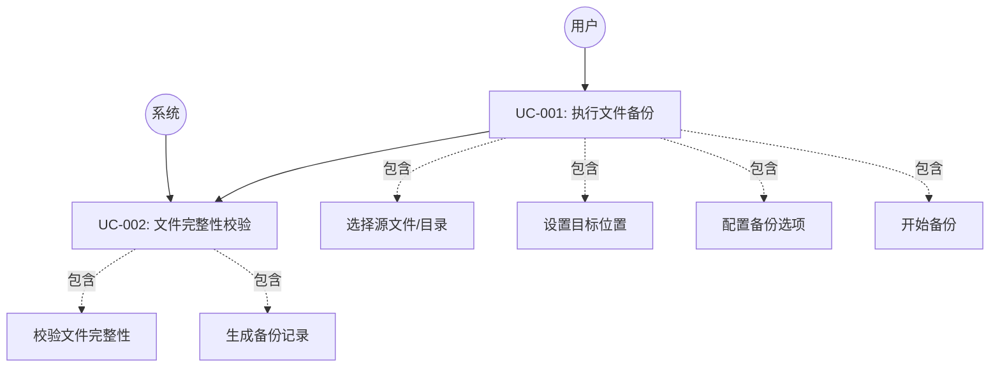
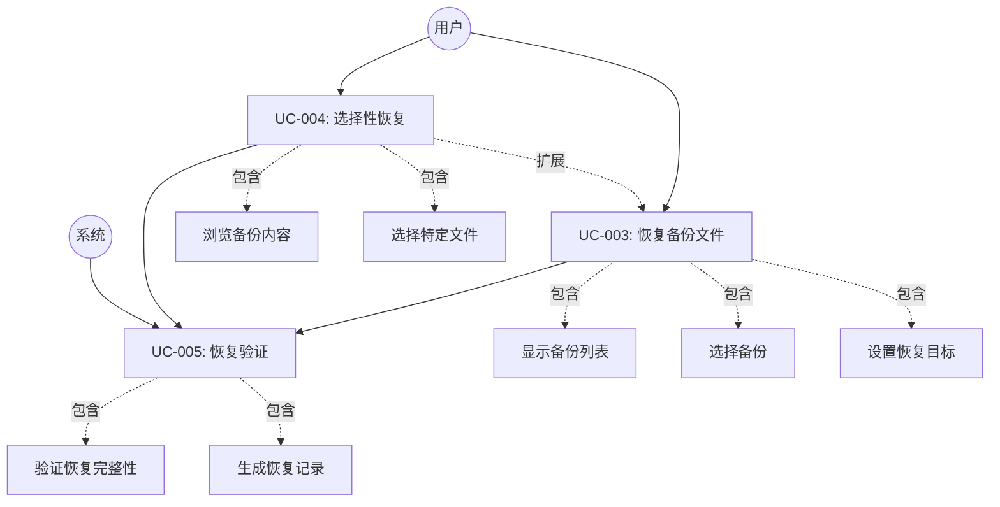
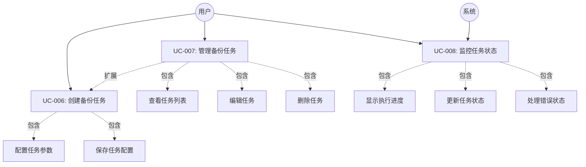
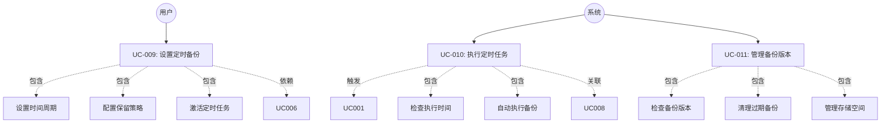
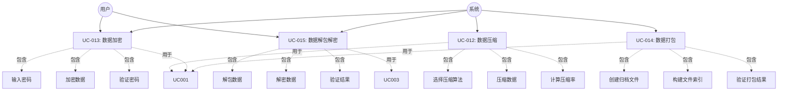
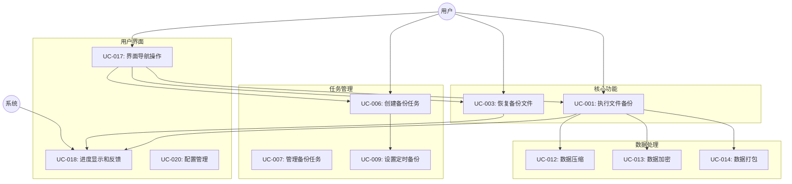

# 文件备份软件 - 需求分析说明书

## 1\. 任务概述

### 1.1 引言

本需求分析说明书旨在详尽、准确地描述『文件备份软件』的功能性与非功能性需求。本文档的目标读者包括项目组成员、指导教师及评审人员，旨在为后续的系统设计、编码实现和软件测试提供明确的依据和统一的共识。本文档将首先对项目进行综合概述，然后详细定义各项功能需求、接口需求及非功能性需求，并对项目进行初步规划。

### 1.2 综合描述

#### 1.2.1 产品的状况

**产品背景与起源**

本软件产品是专门为电子科技大学《软件开发综合实验》课程而设计开发的文件备份软件。随着数字化时代的到来，个人和企业对数据安全的需求日益增长，而现有的备份解决方案往往存在操作复杂、功能冗余或成本高昂等问题。因此，开发一款简洁、高效、跨平台的文件备份工具具有重要的实际意义和教学价值。

**产品分类定义**

根据软件产品的性质分析，本软件产品属于以下分类：

- **✓ 新型的、自主型的产品**：本软件是一个全新设计和开发的独立应用程序，具有自主的功能架构和技术实现。
- **✗ 非产品系列中的下一成员**：本软件不属于任何现有产品系列的延续或扩展。
- **✗ 非成熟产品的改进版本**：本软件不是对现有成熟备份软件的升级或改进版本。
- **✗ 非现有应用软件的替代品**：虽然功能上与市场现有备份软件相似，但本软件并非专门设计来替代特定的现有产品。

**系统关联性分析**

本软件产品在系统架构上具有以下特征：

- **独立性**：本软件是一个完全独立的桌面应用程序，不依赖于大型系统框架，可独立运行和部署。
- **系统交互**：虽然本软件是独立产品，但在运行过程中需要与以下系统组件进行交互：
  
  1. **操作系统层面**：
     - 与Windows、macOS、Linux等操作系统的文件系统API进行交互
     - 利用操作系统的任务调度服务实现定时备份功能
     - 调用系统权限管理机制确保文件访问安全
  
  2. **硬件设备层面**：
     - 与本地存储设备（硬盘、SSD、USB设备等）进行数据读写交互
     - 通过操作系统抽象层访问网络存储设备（如需要）

**接口定义**

基于上述系统交互需求，本软件定义了以下主要接口：

- **文件系统接口**：标准的文件I/O操作接口，支持跨平台文件读写
- **系统服务接口**：调用操作系统提供的定时任务、权限管理等服务
- **硬件抽象接口**：通过操作系统提供的设备驱动接口访问存储硬件
- **用户交互接口**：基于Qt框架的图形用户界面，提供跨平台的用户交互体验

本软件的设计目标是在保持独立性的同时，充分利用现有系统资源，为用户提供高效、可靠的文件备份解决方案。

#### 1.2.2 产品的功能

**功能概述**

本软件产品是一款专业的文件备份与恢复工具，主要为个人用户和小型团队提供数据保护服务。从业务层面来看，本软件专注于解决用户数据安全存储和快速恢复的核心需求。

**主要功能列表**

**基础功能：**

1. **数据备份**：将用户指定的目录树中的文件数据完整地保存到目标位置。
2. **数据还原**：将已备份的文件数据从备份位置恢复到用户指定的目标位置。

**扩展功能（项目组根据实际情况选择实现）：**

3. **特殊文件与元数据支持**：支持备份和恢复如软/硬链接、管道等特殊文件类型，以及文件的属主、权限、时间戳等元数据信息。
4. **定时备份**：允许用户设定周期（如每日、每周），软件将自动在指定时间执行备份任务，并能管理备份版本，淘汰过期数据。
5. **压缩/解压**：通过集成压缩算法（如ZIP, GZIP等）减小备份文件占用的存储空间。
6. **加密/解密**：用户可设定密码，软件使用加密算法（如AES-256）保护备份数据的安全。
7. **打包/解包**：将一次备份任务产生的所有文件和目录打包成一个单一的大文件，便于管理和传输。
8. **图形界面 (GUI)**：提供一个直观、易用的图形用户界面，简化用户的操作流程。

**作用领域界定**

本软件产品的**主要作用领域**包括：
- 个人重要文档、照片、视频等数字资产的备份保护
- 学习资料、项目代码、研究数据的定期备份
- 小型企业日常业务文档的安全存储
- 本地文件系统内的数据备份与恢复操作

本软件产品的**非作用领域**明确包括：
- **非企业级备份解决方案**：不提供大型企业的分布式备份、集群管理等高级功能
- **非云端备份服务**：不提供云存储集成、远程备份服务器搭建等云端功能
- **非系统级备份工具**：不支持操作系统镜像备份、系统分区克隆等系统级操作
- **非实时同步工具**：不提供文件实时同步、版本控制等协作功能
- **非网络备份管理**：不支持网络共享文件夹的自动发现和管理
- **非数据库备份专用**：不提供专门的数据库备份优化和事务日志处理

通过明确作用领域的边界，本软件致力于在文件备份与恢复的核心业务领域内提供简洁、高效、可靠的解决方案。

#### 1.2.3 用户类和特性

**用户类分类与特征描述**

本软件产品面向多种类型的用户群体，根据用户重要性和使用特征，可分为重要用户类和非重要用户类。

**重要用户类（主要目标用户）：**

1. **个人用户**
   - **特征描述**：个人计算机用户，需要保护个人数字资产
   - **技能水平**：计算机操作技能从初级到中级，对备份软件操作要求简单直观
   - **使用场景**：备份个人文档、照片、视频、项目代码、研究数据等重要文件
   - **关键需求**：操作简便性、数据可靠性、恢复速度快
   - **使用频率**：定期备份（每周/每月），紧急恢复（偶发）

2. **学生用户**
   - **特征描述**：在校学生，需要保护学习和研究成果
   - **技能水平**：具备基本计算机操作能力，对新软件学习能力较强
   - **使用场景**：备份课程资料、毕业设计、研究数据、编程项目等
   - **关键需求**：免费或低成本、跨平台兼容、版本管理
   - **使用频率**：频繁备份（每日/每周），学期末集中备份

3. **小型企业/团队用户**
   - **特征描述**：5-50人规模的小型企业或工作团队
   - **技能水平**：具备一定IT管理能力，注重效率和自动化
   - **使用场景**：备份业务文档、客户资料、项目文件、财务数据等
   - **关键需求**：自动化备份、数据安全性、多用户管理、定时调度
   - **使用频率**：自动定时备份（每日），手动备份（项目节点）

**非重要用户类（次要支持用户）：**

4. **家庭用户**
   - **特征描述**：家庭共用计算机的多个成员
   - **技能水平**：技能水平参差不齐，从初级到中级
   - **使用场景**：备份家庭照片、视频、文档等共享资料
   - **关键需求**：多用户文件夹支持、简单易用
   - **使用频率**：不定期备份，通常由家庭技术负责人操作

5. **技术爱好者**
   - **特征描述**：对技术有浓厚兴趣的高级用户
   - **技能水平**：高级计算机用户，喜欢定制和优化
   - **使用场景**：测试软件功能、提供反馈建议、高级配置
   - **关键需求**：高级功能、命令行接口、可定制性
   - **使用频率**：频繁使用和测试各种功能

**外部需求用户类（通过接口获得服务）：**

6. **系统管理员**
   - **接口类型**：系统硬件接口、日志接口
   - **需求描述**：通过系统日志监控备份状态，通过硬件接口管理存储设备
   - **关键需求**：详细的操作日志、错误报告、性能监控数据
   - **交互方式**：读取软件生成的日志文件和状态报告

7. **第三方监控系统**
   - **接口类型**：应用程序接口（API）
   - **需求描述**：获取备份任务执行状态、成功率统计、存储使用情况
   - **关键需求**：标准化API接口、实时状态查询、历史数据导出
   - **交互方式**：通过REST API或配置文件接口获取数据

8. **备份策略制定者**
   - **接口类型**：报表接口
   - **需求描述**：通过备份报告分析数据保护策略的有效性
   - **关键需求**：详细的备份成功率报表、存储空间使用报表、恢复时间统计
   - **交互方式**：定期生成和查看CSV、PDF格式的统计报表

**用户重要性排序：**
1. 个人用户（最重要）- 核心目标市场
2. 学生用户（高重要性）- 主要用户群体  
3. 小型企业用户（高重要性）- 商业价值用户
4. 家庭用户（中等重要性）- 扩展市场
5. 技术爱好者（中等重要性）- 产品改进反馈来源
6. 外部接口用户（低重要性）- 附加功能需求

### 1.3 运行环境

#### 1.3.1 基本配置

  * **硬件平台**：PC (x86-64架构) 
  * **操作系统**：支持 Windows 10+、macOS 10.15+、Linux (如 Ubuntu 18.04+)

#### 1.3.2 其他配置

  * **内存**：最低 2GB RAM
  * **硬盘**：至少 100MB 可用磁盘空间用于安装软件本体，备份空间由用户数据量决定。

## 2\. 功能需求

### 2.1 功能划分

根据软件的核心业务，可将系统功能划分为以下几个主要模块：

1.  **核心备份模块**：负责执行文件、目录的读取和写入操作，是数据备份功能的基础。
2.  **核心恢复模块**：负责读取备份数据并将其还原到指定位置，是数据恢复功能的基础。
3.  **任务管理模块**：负责创建、配置、启动和监控备份/恢复任务。
4.  **定时调度模块**：负责管理和触发定时备份任务。
5.  **数据处理模块**：负责实现压缩、加密、打包等扩展功能。
6.  **用户界面模块**：提供图形化的操作界面，处理用户交互。

### 2.2 系统用例

根据功能划分的6个主要模块，系统用例详细描述如下：

#### 2.2.1 核心备份模块用例图

**用例说明：**
- **UC-001：执行文件备份** - 用户选择文件或目录进行备份操作
- **UC-002：文件完整性校验** - 系统在备份过程中验证文件数据完整性

#### 2.2.2 核心恢复模块用例图

**用例说明：**
- **UC-003：恢复备份文件** - 用户从备份中恢复丢失或损坏的文件
- **UC-004：选择性恢复** - 用户浏览备份内容并选择特定文件进行恢复
- **UC-005：恢复验证** - 系统验证恢复文件的完整性和正确性

#### 2.2.3 任务管理模块用例图

**用例说明：**
- **UC-006：创建备份任务** - 用户创建新的备份任务并配置参数
- **UC-007：管理备份任务** - 用户查看、编辑、删除已存在的备份任务
- **UC-008：监控任务状态** - 系统实时监控和显示任务执行状态

#### 2.2.4 定时调度模块用例图

**用例说明：**
- **UC-009：设置定时备份** - 用户配置自动定时备份任务
- **UC-010：执行定时任务** - 系统按计划自动执行备份任务
- **UC-011：管理备份版本** - 系统自动管理备份版本并清理过期数据

#### 2.2.5 数据处理模块用例图

**用例说明：**
- **UC-012：数据压缩** - 系统对备份数据进行压缩处理以节省空间
- **UC-013：数据加密** - 系统使用用户提供的密码对备份数据加密
- **UC-014：数据打包** - 系统将多个备份文件打包为单一文件
- **UC-015：数据解包解密** - 系统在恢复时解包和解密备份数据

#### 2.2.6 用户界面模块用例图

```mermaid
graph TB
    User((用户))
    System((系统))
    
    UC016[UC-016: 用户登录认证]
    UC017[UC-017: 界面导航操作]
    UC018[UC-018: 进度显示和反馈]
    UC019[UC-019: 错误处理和提示]
    UC020[UC-020: 配置管理]
    
    User --> UC016
    User --> UC017
    System --> UC018
    System --> UC019
    User --> UC020
    
    UC016 -.-> |包含| StartApp[启动应用]
    UC016 -.-> |包含| Authenticate[身份验证]
    UC016 -.-> |包含| LoadInterface[加载主界面]
    
    UC017 -.-> |包含| Navigate[界面导航]
    UC017 -.-> |包含| ClickButtons[按钮操作]
    UC017 -.-> |包含| MenuSelection[菜单选择]
    
    UC018 -.-> |包含| ShowProgress[显示进度条]
    UC018 -.-> |包含| UpdateStatus[更新状态信息]
    UC018 -.-> |包含| RealTimeUpdate[实时更新]
    
    UC019 -.-> |包含| CatchError[捕获错误]
    UC019 -.-> |包含| ShowMessage[显示错误信息]
    UC019 -.-> |包含| ProvideHelp[提供解决建议]
    
    UC020 -.-> |包含| ViewSettings[查看设置]
    UC020 -.-> |包含| ModifyConfig[修改配置]
    UC020 -.-> |包含| SaveSettings[保存设置]
    
    UC017 -.-> |触发| UC001
    UC017 -.-> |触发| UC003
    UC017 -.-> |触发| UC006
    UC018 -.-> |支持| UC001
    UC018 -.-> |支持| UC003
```

**用例说明：**
- **UC-016：用户登录认证** - 用户启动软件并进行身份验证（如需要）
- **UC-017：界面导航操作** - 用户通过图形界面导航和操作各功能模块
- **UC-018：进度显示和反馈** - 系统实时显示操作进度和状态信息
- **UC-019：错误处理和提示** - 系统捕获错误并向用户显示友好的错误信息
- **UC-020：配置管理** - 用户通过界面配置软件参数和偏好设置

#### 2.2.7 系统整体用例关系图

### 2.3 详细用例描述

#### 2.3.1 用例编号 UC-001：执行文件备份

**用例图**
- **参与者 (Actor)**：用户
- **用例 (Use Case)**：执行文件备份
- **关系**：用户 → 执行文件备份

**用例描述**

| **用例标识** | UC-001 |
| :--- | :--- |
| **用例名称** | 执行文件备份 |
| **创建人** | 安知茂 |
| **创建日期** | 2025年10月11日 |
| **语境目标** | 用户希望将重要的文件或文件夹备份到另一个安全的位置。 |
| **前置条件** | 1. 软件已正常启动 2. 源文件/目录存在且可访问 3. 目标位置可写入且有足够空间 |
| **成功的结束状态** | 1. 指定的文件/目录被成功备份到目标位置 2. 生成备份记录和元数据 3. 备份完整性校验通过 |
| **失败的结束状态** | 1. 备份任务因故失败并记录错误信息 2. 系统清理失败产生的临时文件 3. 向用户显示明确的失败原因 |
| **参与者** | 用户 |
| **触发器** | 用户在主界面发起一个新的备份任务 |
| **事件流** | **基本流程** 1. 用户选择『创建备份』功能 2. 用户选择需要备份的源文件或目录 3. 用户指定用于存放备份数据的目标位置 4. 用户配置备份选项（压缩、加密、打包等） 5. 系统验证源和目标的有效性 6. 用户点击『开始备份』按钮 7. 系统开始执行备份，并实时显示进度 8. 系统进行文件完整性校验 9. 系统完成备份，生成备份记录 10. 系统提示用户任务成功完成  **扩展流程** 7a. 用户在备份过程中点击『取消』   7a1. 系统确认取消操作   7a2. 系统中断备份进程   7a3. 系统清理本次任务产生的临时文件   7a4. 返回主界面  **异常事件流** 5a. 源文件不存在或无访问权限   5a1. 系统提示文件访问权限错误   5a2. 用户重新选择有效的源文件 5b. 目标位置无写入权限或空间不足   5b1. 系统提示目标位置错误信息   5b2. 用户重新选择合适的目标位置 7b. 备份过程中发生I/O错误   7b1. 系统停止备份操作   7b2. 系统记录详细错误日志   7b3. 系统向用户显示错误信息和建议解决方案   7b4. 系统清理临时文件 8a. 文件完整性校验失败   8a1. 系统标记校验失败的文件   8a2. 系统重试备份失败的文件   8a3. 如果重试失败，提示用户并记录错误 |
| **非功能需求** | 1. 备份速度不低于 50MB/s（受硬件限制） 2. 备份过程CPU占用率低于 50% 3. 内存使用量不超过 500MB 4. 支持中断和续传功能 |

#### 2.3.2 用例编号 UC-003：恢复备份文件

**用例图**
- **参与者 (Actor)**：用户
- **用例 (Use Case)**：恢复备份文件
- **关系**：用户 → 恢复备份文件

**用例描述**

| **用例标识** | UC-003 |
| :--- | :--- |
| **用例名称** | 恢复备份文件 |
| **创建人** | 安知茂 |
| **创建日期** | 2025年10月11日 |
| **语境目标** | 用户因文件丢失或损坏，需要从之前的备份中恢复文件。 |
| **前置条件** | 1. 存在至少一个成功的备份记录 2. 备份文件完整且可访问 3. 恢复目标位置可写入 |
| **成功的结束状态** | 1. 用户选择的文件成功恢复到指定位置 2. 恢复文件通过完整性验证 3. 生成恢复操作记录 |
| **失败的结束状态** | 1. 恢复任务失败并记录错误信息 2. 系统清理恢复过程中的临时文件 3. 向用户显示失败原因和建议 |
| **参与者** | 用户 |
| **触发器** | 用户在主界面选择『恢复』功能 |
| **事件流** | **基本流程** 1. 用户选择『恢复数据』功能 2. 系统显示可用的备份列表 3. 用户选择一个备份任务/文件 4. 系统验证备份文件完整性 5. 系统展示该备份中包含的文件和目录结构 6. 用户选择要恢复的特定文件/目录，或选择全部恢复 7. 用户指定恢复文件的目标位置 8. 用户点击『开始恢复』按钮 9. 系统开始执行恢复，并实时显示进度 10. 系统进行恢复文件完整性校验 11. 系统完成恢复，提示用户任务成功  **扩展流程** 6a. 用户需要预览备份内容   6a1. 系统提供文件预览功能   6a2. 用户确认要恢复的文件 9a. 用户在恢复过程中点击『取消』   9a1. 系统确认取消操作   9a2. 系统中断恢复进程   9a3. 系统清理临时文件  **异常事件流** 3a. 没有可用的备份记录   3a1. 系统提示无可用备份   3a2. 引导用户先进行备份操作 4a. 备份文件校验失败或已损坏   4a1. 系统提示备份文件损坏   4a2. 系统尝试部分恢复可用数据   4a3. 提示用户检查备份源或使用其他备份 7a. 目标位置无写入权限或空间不足   7a1. 系统提示权限或空间错误   7a2. 用户重新选择目标位置 9b. 恢复过程中发生I/O错误   9b1. 系统停止恢复操作   9b2. 系统记录错误日志   9b3. 系统向用户显示错误信息 10a. 恢复文件完整性校验失败   10a1. 系统提示数据可能损坏   10a2. 系统提供重新恢复选项 |
| **非功能需求** | 1. 恢复后的文件需经过完整性校验（MD5/SHA256） 2. 恢复速度不低于 50MB/s 3. 支持大文件的分块恢复 4. 提供恢复进度的详细信息 |

## 3\. 外部接口需求

### 3.1 用户界面 

  * 软件将提供一个基于Qt框架构建的图形用户界面(GUI) 。
  * 界面设计将遵循简洁、直观的原则，主界面提供『备份』、『恢复』、『设置』等核心功能入口 。
  * 将提供备份任务配置向导，引导用户分步完成备份设置 。
  * 界面将包含实时进度条和状态信息栏，用于反馈当前任务的执行情况 。
  * 错误信息将以清晰、易于理解的对话框形式展示给用户 。

### 3.2 硬件接口 

  * **支持的硬件类型**：本软件主要与标准存储设备进行交互，包括但不限于机械硬盘(HDD)、固态硬盘(SSD)、USB外部驱动器等 。
  * **软、硬件之间交流的数据**：软件通过操作系统提供的文件系统接口，读取源设备的文件数据，并将处理后（如压缩、加密）的备份数据写入目标设备 。
  * **使用的通讯协议**：通过操作系统标准的I/O协议（如SATA, NVMe, USB等协议的抽象层）与硬件进行通信 。

### 3.3 软件接口 

  * **操作系统**：软件将与Windows, macOS, Linux等操作系统的底层API进行交互，以实现文件读写、元数据访问、定时任务调度等功能 。
  * **函数库**：
      * **Qt框架**：作为核心依赖库，用于构建跨平台的GUI和实现部分底层功能  。
      * **压缩库** (例如 zlib, lzma)：用于实现数据的压缩与解压功能。
      * **加密库** (例如 OpenSSL, Crypto++)：用于实现数据的加密与解密功能。
  * **文件系统**：软件需要能够正确处理多种文件系统（如NTFS, APFS, ext4）的特性，包括对长文件名、特殊字符、文件权限等的支持。

## 4．其它非功能性需求

### 4.1 性能需求 

  * **响应时间**：GUI界面操作的响应时间应小于1秒。
  * **处理速度**：在普通硬盘上，文件的备份和恢复速度应不低于50MB/s（实际速度受硬件性能瓶颈影响）。
  * **资源占用**：
      * **内存**：空闲状态下，程序内存占用应小于200MB。
      * **CPU**：在执行备份/恢复任务时，CPU占用率应控制在50%以下，以避免影响用户其他操作。

### 4.2 安全性需求 

  * **数据加密**：对于选择加密的备份任务，必须使用强加密算法（如AES-256）对备份数据进行加密 。
  * **密码安全**：用户设定的密码需经过安全的哈希处理后存储，不以明文形式保存。
  * **权限控制**：软件应在当前用户的权限下运行，遵循操作系统的文件访问控制策略，不会越权访问文件。

### 4.3 软件质量属性 

  * **可靠性**：软件必须提供完善的错误处理和异常捕获机制。在备份或恢复过程中，需进行数据校验（如MD5/SHA256）以确保数据的完整性。支持任务中断和续传功能以应对意外情况。
  * **易用性**：界面友好，操作流程清晰，目标是让新用户在15分钟内能掌握基本备份和恢复操作。提供清晰的错误提示和必要的帮助文档。
  * **可维护性**：代码将采用模块化设计，遵循C++编码规范，并提供必要的注释和文档，以方便后续的维护和功能扩展。
  * **兼容性**：软件需能在主流的Windows、macOS和Linux操作系统上稳定运行，并兼容常见的文件系统。

## 5. 项目规划 

### 5.1 人员分工 

项目由三位成员分工，具体安排如下 ：

| 角 色 | 主要职责 | 负责模块 | 人员 | 备注 |
| :--- | :--- | :--- | :--- | :--- |
| **项目经理 (PM)** | 项目全面负责，需求分析，系统设计，进度控制，代码框架搭建与汇总 | 核心框架，任务管理模块 | antimo | 兼任核心开发 |
| **程序员 (DEV)** | **模块编码**与单元测试 | 核心备份/恢复模块，数据处理模块 | Mich | |
| **程序员 (DEV)** | 模块编码与**单元测试** | 用户界面(GUI)模块，定时调度模块，测试 | yrq | |

### 5.2 项目总体规划 

项目将遵循迭代开发的模式，计划分为四个主要阶段。具体时间安排将通过甘特图进行可视化管理 。

  * **第一阶段 (W1): 需求分析与系统设计**

      * 完成详细的需求分析文档编写。
      * 完成系统总体设计和模块划分。
      * 搭建项目基础框架和开发环境。

  * **第二阶段 (W2-W3): 核心功能开发**

      * 实现基础的文件/目录备份与恢复功能。
      * 完成核心模块的单元测试。

  * **第三阶段 (W4-W6): 扩展功能与GUI开发**

      * 根据优先级实现扩展功能（如压缩、加密、定时备份）。
      * 开发并集成图形用户界面。

  * **第四阶段 (W7): 集成测试与文档完善**

      * 进行系统集成测试，修复Bug。
      * 编写用户手册、测试报告等相关文档。
      * 准备项目最终交付。